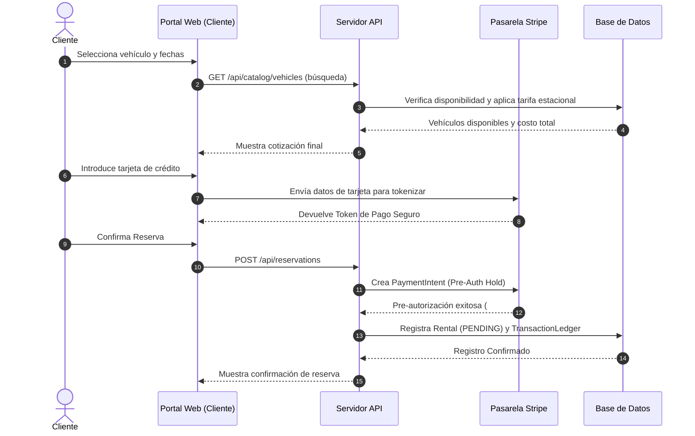
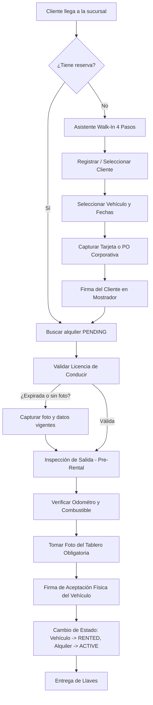

# Documentación de FleetVault: Introducción y Flujos de Operación

## 1. Introducción al Sistema
**FleetVault Enterprise** (anteriormente conocido como *RentCar Enterprise*) es un sistema de gestión de flotas y facturación de alquileres de vehículos diseñado para el mercado de la República Dominicana. El sistema actúa como un puente tecnológico entre el portal de reservas en línea de los clientes y las operaciones físicas en el patio o sucursal de alquiler.

### Objetivos Principales
* **Automatización del Control Operativo:** Seguimiento en tiempo real de vehículos, inspecciones de daños físicas y estados de limpieza.
* **Mitigación de Riesgos Financieros:** Integración de pasarelas de pago (Stripe) para retenciones preventivas (*pre-authorizations*) y validaciones del límite de crédito.
* **Transparencia en Reclamaciones:** Generación de contratos en PDF con firmas digitales e historial fotográfico para protección contra contracargos (*chargebacks*).
* **Gestión de Incentivos:** Liquidación automatizada de comisiones para empleados basadas en turnos de trabajo y volumen de alquileres cerrados.

---

## 2. Perfiles de Clientes
El sistema procesa dos categorías bien definidas de clientes, aplicando reglas de negocio distintas para cada una:

1. **Cliente Individual (Persona Física):**
   * Requiere identificación oficial única (Cédula de Identidad y Electoral o Pasaporte).
   * Requiere registro obligatorio de tarjeta de crédito mediante Stripe para depósitos de seguridad.
   * Depósito de seguridad estándar: **RD$ 15,000.00** (establecido en la tabla `FeeConfig`).
   * Facturación inmediata y procesamiento de retenciones preventivas de tarjeta en tiempo real.

2. **Cliente Corporativo (Persona Jurídica / Empresa):**
   * Opera bajo una línea de crédito comercial pre-aprobada.
   * Requiere un número de Orden de Compra (PO - *Purchase Order*) válido para iniciar un alquiler.
   * Depósito de seguridad exonerado.
   * Facturación acumulada mensual o con términos de pago neto (Net-15 / Net-30).
   * Conductores autorizados asociados a la cuenta corporativa principal.

---

## 3. Flujos de Trabajo End-to-End

### A. Registro y Reserva en Línea (Portal del Cliente)
El portal de autoservicio permite a los usuarios cotizar y reservar vehículos de forma autónoma:
1. **Registro Rápido:** El cliente crea una cuenta con datos mínimos (nombre, correo electrónico y contraseña).
2. **Búsqueda en el Catálogo:** Filtra por rango de fechas, tipo de vehículo (SUV, Sedan, Deportivo, Compacto, de Carga) y fabricante.
3. **Cálculo de Tarifas Dinámicas:** El motor de reservas aplica multiplicadores estacionales (por ejemplo, tarifas altas durante Navidad o Semana Santa) sobre la tarifa base de la categoría del vehículo.
4. **Pasarela de Pago (Wallet):** El cliente ingresa su tarjeta de crédito. La tarjeta se tokeniza mediante Stripe Elements y se guarda de forma segura en su billetera (*wallet*), bloqueando su eliminación si existen alquileres activos.
5. **Retención de Garantía:** Se ejecuta una pre-autorización en Stripe por el costo total estimado más el depósito de seguridad.
6. **Estado de Reserva:** El alquiler se registra en la base de datos con estado `PENDING` (pendiente de recogida).

---

### B. Flujo de Walk-In (Alquiler Directo en Mostrador)
Cuando un cliente llega directamente a la sucursal sin reserva previa, el agente de mostrador sigue un asistente estructurado de 4 pasos para mitigar errores de facturación:

1. **Paso 1: Parámetros del Alquiler:**
   * Selección del cliente existente (o creación rápida).
   * Selección del vehículo disponible. El sistema bloquea el campo de tarifa diaria a "solo lectura" basándose en el tarifario de la categoría del vehículo para evitar alteraciones manuales del agente.
   * Introducción de fechas de alquiler.
2. **Paso 2: Métodos de Pago (Wallet):**
   * Consulta de tarjetas guardadas en Stripe para el cliente seleccionado o registro de una nueva tarjeta.
   * Para clientes corporativos, se omite la tarjeta y se solicita el número de Orden de Compra (PO).
3. **Paso 3: Firmas Digitales:**
   * Captura de la firma e-sign del cliente en la tableta del mostrador, confirmando la aceptación de las tarifas y depósito de garantía.
4. **Paso 4: Confirmación:**
   * Muestra la confirmación del alquiler y genera el contrato preliminar.

---

### C. Despacho y Salida del Patio (Yard Checkout)
Para que un vehículo pueda salir de la sucursal, se deben completar estrictas validaciones físicas y de documentos:

1. **Validación de Credenciales de Conducir:**
   * El sistema obliga a registrar la Licencia de Conducir (País/Estado, Número, Expiración).
   * La fecha de expiración de la licencia debe ser estrictamente posterior a la fecha de devolución programada del alquiler:
     $$\text{Fecha Expiración Licencia} > \text{Fecha Devolución Programada}$$
   * Es mandatorio subir una fotografía de la licencia de conducir a través de la webcam del mostrador o cámara del dispositivo móvil.
2. **Inspección Física Inicial (Pre-Rental):**
   * El inspector del patio realiza un recorrido visual del vehículo con un dispositivo móvil.
   * Registra daños preexistentes (asociados a la tabla `DamageType` como rayones, golpes, llantas) indicando la posición en el vehículo.
   * Registra el nivel de combustible (EMPTY, QUARTER, HALF, THREE_QUARTERS, FULL) y el odómetro actual.
   * **Foto del Odómetro y Combustible:** Es obligatorio tomar una fotografía del panel de instrumentos que muestre el millaje y el indicador de combustible antes de autorizar la salida.
   * Si la inspección no detecta daños críticos nuevos, el estado de la inspección se marca como `PASSED`. Si detecta daños severos, pasa a `FLAGGED`, lo que bloquea el alquiler y obliga a reasignar otro vehículo.
3. **Firma de Entrega:**
   * El cliente firma la conformidad física en la tableta del patio.
   * El estado del vehículo cambia automáticamente a `RENTED` y el alquiler a `ACTIVE`.

---

### D. Recepción del Vehículo y Cierre del Alquiler (Yard Return)
El proceso de devolución calcula automáticamente las penalizaciones correspondientes para evitar discrepancias con el cliente:

1. **Inspección Física Final (Return Inspection):**
   * El inspector de patio evalúa el vehículo, registrando daños nuevos (asociados a la tabla `DamageType`) en el sistema.
   * Registra el odómetro de retorno (el cual debe ser $\ge$ al odómetro de salida) y el nivel de combustible.
   * Captura una foto obligatoria del panel de instrumentos.
2. **Cálculo Automatizado de Cargos Adicionales:**
   * **Late Fee (Cargos por Retraso):** El sistema da una tolerancia de **1 hora** de gracia. Transcurrido ese tiempo, cobra por hora de retraso según la tarifa horaria:
     $$\text{Late Fee} = \text{Diferencia en Horas} \times \text{LATE\_FEE\_PER\_HOUR (RD\$ 1,500)}$$
   * **Refueling Penalty (Penalización por Combustible):** Si el tanque regresa con menos combustible que al salir, se cobra un cargo base más un adicional por cada nivel de combustible faltante:
     $$\text{Fuel Fee} = \text{FUEL\_FLAT\_FEE (RD\$ 2,000)} + (\text{Diferencia de Combustible} \times \text{FUEL\_PER\_STEP (RD\$ 1,000)})$$
   * **Damage Penalty (Penalización por Daños):** Se calcula a partir de los `FeeConfig` correspondientes a daños nuevos:
     * Daño en neumático: **RD$ 5,000** por neumático dañado registrado.
     * Vidrios rotos: **RD$ 12,000**.
     * Rayones nuevos en carrocería: **RD$ 8,000**.
     * Neumático de repuesto faltante: **RD$ 3,000**.
     * Gato hidráulico faltante: **RD$ 2,000**.
3. **Cierre de Contrato y Conciliación Financiera:**
   * El cliente firma la devolución en el dispositivo del patio para validar los cargos adicionales.
   * **Clientes Individuales:** El sistema captura el monto final (alquiler + penalizaciones) de la pre-autorización de Stripe. El exceso del depósito bloqueado se libera automáticamente de forma inmediata.
   * **Clientes Corporativos:** Se genera una factura basada en la Orden de Compra (PO) y se carga al balance de la línea de crédito de la empresa.
   * El alquiler cambia a estado `COMPLETED`. Si hay daños nuevos, el vehículo pasa a **`MAINTENANCE`**; si no hay daños nuevos, pasa a **`UNDER_INSPECTION`** con estado de limpieza en **`DIRTY`** (cola de lavado).

---

### E. Restablecimiento de Flota e Inspección de Mantenimiento
1. **Lavado y Acondicionamiento:**
   * Los vehículos en estado `DIRTY` ingresan a la sección de lavado. El personal de limpieza cambia su estado a `CLEAN` a través de su panel una vez terminado.
   * Si el estado es `CLEAN` (y no está en mantenimiento), el vehículo vuelve a estar disponible (`AVAILABLE`) en el catálogo en tiempo real.
2. **Ciclo de Mantenimiento Preventivo:**
   * El sistema genera una alerta visual y bloquea reservas si el odómetro del vehículo supera las **5,000 millas** desde su último mantenimiento registrado:
     $$\text{Odómetro Actual} - \text{Último Odómetro Mantenimiento} \ge 5000\text{ millas}$$
   * El vehículo se bloquea bajo el estado `MAINTENANCE` y cualquier reserva pendiente (`PENDING`) asociada es cancelada automáticamente, sugiriendo alternativas equivalentes al agente.
