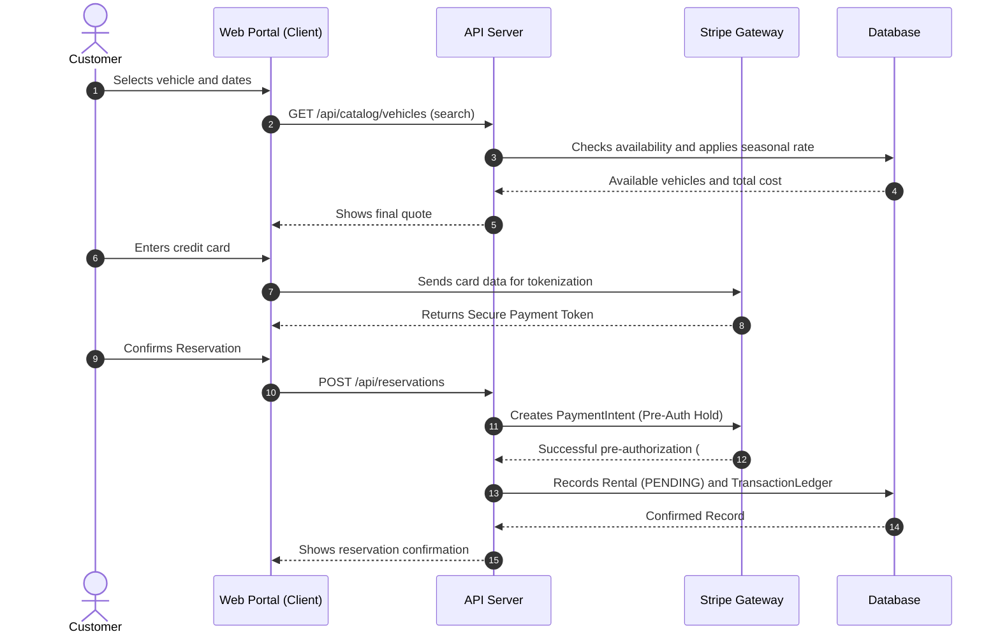
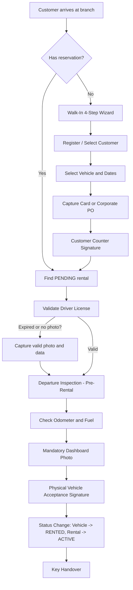

# FleetVault Documentation: Introduction and Operation Flows

## 1. System Introduction
**FleetVault Enterprise** (formerly known as *RentCar Enterprise*) is a fleet management and vehicle rental billing system designed for the Dominican Republic market. The system acts as a technological bridge between the customers' online reservation portal and the physical operations at the rental branch or yard.

### Main Objectives
* **Operational Control Automation:** Real-time tracking of vehicles, physical damage inspections, and cleaning statuses.
* **Financial Risk Mitigation:** Payment gateway integration (Stripe) for preventive pre-authorizations and credit limit validations.
* **Claim Transparency:** PDF contract generation with digital signatures and photographic history for chargeback protection.
* **Incentive Management:** Automated commission settlement for employees based on work shifts and closed rental volume.

---

## 2. Customer Profiles
The system processes two well-defined customer categories, applying distinct business rules for each:

1. **Individual Customer (Natural Person):**
   * Requires a unique official ID (Cédula de Identidad y Electoral or Passport).
   * Requires mandatory credit card registration via Stripe for security deposits.
   * Standard security deposit: **RD$ 15,000.00** (set in the `FeeConfig` table).
   * Immediate billing and real-time pre-authorization processing.

2. **Corporate Customer (Legal Entity / Company):**
   * Operates under a pre-approved commercial credit line.
   * Requires a valid Purchase Order (PO) number to initiate a rental.
   * Security deposit waived.
   * Accumulated monthly billing or net payment terms (Net-15 / Net-30).
   * Authorized drivers associated with the main corporate account.

---

## 3. End-to-End Workflows

### A. Online Registration and Reservation (Customer Portal)
The self-service portal allows users to quote and reserve vehicles autonomously:
1. **Quick Registration:** The customer creates an account with minimal data (name, email, and password).
2. **Catalog Search:** Filter by date range, vehicle type (SUV, Sedan, Sport, Compact, Cargo) and manufacturer.
3. **Dynamic Rate Calculation:** The reservation engine applies seasonal multipliers (e.g., peak rates during Christmas or Easter) over the base rate of the vehicle's category.
4. **Payment Gateway (Wallet):** The customer enters their credit card. The card is tokenized via Stripe Elements and securely saved in their wallet, blocking deletion if there are active rentals.
5. **Security Hold:** A pre-authorization is executed on Stripe for the total estimated cost plus the security deposit.
6. **Reservation Status:** The rental is recorded in the database with `PENDING` status (pending pickup).

---

### B. Walk-In Flow (Direct Counter Rental)
When a customer arrives directly at the branch without a prior reservation, the counter agent follows a structured 4-step wizard to mitigate billing errors:

1. **Step 1: Rental Parameters:**
   * Select existing customer (or quick creation).
   * Select available vehicle. The system locks the daily rate field to "read-only" based on the vehicle category's rate card to prevent manual agent alterations.
   * Enter rental dates.
2. **Step 2: Payment Methods (Wallet):**
   * Query saved Stripe cards for the selected customer or register a new card.
   * For corporate customers, the card is skipped and the Purchase Order (PO) number is requested.
3. **Step 3: Digital Signatures:**
   * Capture the customer's e-signature on the counter tablet, confirming acceptance of rates and security deposit.
4. **Step 4: Confirmation:**
   * Shows rental confirmation and generates the preliminary contract.

---

### C. Dispatch and Yard Checkout
For a vehicle to leave the branch, strict physical and document validations must be completed:

1. **Driver License Validation:**
   * The system requires registering the Driver's License (Country/State, Number, Expiration).
   * The license expiration date must be strictly after the scheduled rental return date:
     $$\text{License Expiration Date} > \text{Scheduled Return Date}$$
   * It is mandatory to upload a photograph of the driver's license via the counter webcam or mobile device camera.
2. **Initial Physical Inspection (Pre-Rental):**
   * The yard inspector performs a visual walkaround of the vehicle using a mobile device.
   * Records pre-existing damages (associated with the `DamageType` table like scratches, dents, tires) indicating the position on the vehicle.
   * Records fuel level (EMPTY, QUARTER, HALF, THREE_QUARTERS, FULL) and current odometer.
   * **Odometer and Fuel Photo:** It is mandatory to take a photograph of the instrument panel showing the mileage and fuel gauge before authorizing departure.
   * If the inspection finds no critical new damages, the inspection status is marked as `PASSED`. If severe damages are detected, it becomes `FLAGGED`, which blocks the rental and forces reassignment of another vehicle.
3. **Delivery Signature:**
   * The customer signs the physical conformance on the yard tablet.
   * The vehicle status automatically changes to `RENTED` and the rental to `ACTIVE`.

---

### D. Vehicle Reception and Rental Closure (Yard Return)
The return process automatically calculates corresponding penalties to avoid discrepancies with the customer:

1. **Final Physical Inspection (Return Inspection):**
   * The yard inspector evaluates the vehicle, recording new damages (associated with the `DamageType` table) in the system.
   * Records return odometer (which must be $\ge$ the checkout odometer) and fuel level.
   * Captures a mandatory photo of the instrument panel.
2. **Automated Additional Charges Calculation:**
   * **Late Fee:** The system gives a **1 hour** grace period. After that, it charges per hour of delay based on the hourly rate:
     $$\text{Late Fee} = \text{Difference in Hours} \times \text{LATE\_FEE\_PER\_HOUR (RD\$ 1,500)}$$
   * **Refueling Penalty:** If the tank returns with less fuel than at departure, a base charge plus an additional charge per missing fuel level is applied:
     $$\text{Fuel Fee} = \text{FUEL\_FLAT\_FEE (RD\$ 2,000)} + (\text{Fuel Difference} \times \text{FUEL\_PER\_STEP (RD\$ 1,000)})$$
   * **Damage Penalty:** Calculated from the `FeeConfig` entries corresponding to new damages:
     * Tire damage: **RD$ 5,000** per damaged tire recorded.
     * Broken glass: **RD$ 12,000**.
     * New body scratches: **RD$ 8,000**.
     * Missing spare tire: **RD$ 3,000**.
     * Missing hydraulic jack: **RD$ 2,000**.
3. **Contract Closure and Financial Settlement:**
   * The customer signs the return on the yard device to validate additional charges.
   * **Individual Customers:** The system captures the final amount (rental + penalties) from the Stripe pre-authorization. The excess blocked deposit is automatically released immediately.
   * **Corporate Customers:** An invoice is generated based on the Purchase Order (PO) and charged to the company's credit line balance.
   * The rental changes to `COMPLETED` status. If there are new damages, the vehicle goes to **`MAINTENANCE`**; if no new damages, it goes to **`UNDER_INSPECTION`** with cleaning status **`DIRTY`** (wash queue).

---

### E. Fleet Reset and Maintenance Inspection
1. **Washing and Reconditioning:**
   * Vehicles in `DIRTY` status enter the washing section. Cleaning staff change their status to `CLEAN` through their panel once finished.
   * If the status is `CLEAN` (and not under maintenance), the vehicle becomes available (`AVAILABLE`) in the catalog in real time.
2. **Preventive Maintenance Cycle:**
   * The system generates a visual alert and blocks reservations if the vehicle's odometer exceeds **5,000 miles** since its last recorded maintenance:
     $$\text{Current Odometer} - \text{Last Maintenance Odometer} \ge 5000\text{ miles}$$
   * The vehicle is locked under `MAINTENANCE` status and any associated pending (`PENDING`) reservations are automatically canceled, suggesting equivalent alternatives to the agent.
