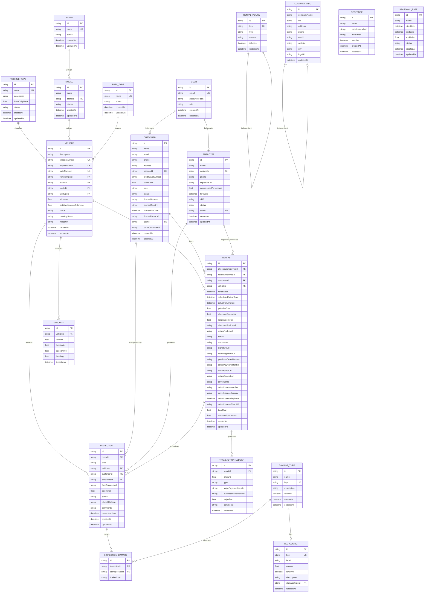

# Database Design and Entity Model

**FleetVault Enterprise** data persistence is managed through a relational engine (**SQLite** in development and testing environments, and **PostgreSQL** via **Supabase** in production). Access and migrations are controlled through **Prisma ORM**.

---

## 1. Entity-Relationship Diagram (ERD)

Below is the conceptual database model with the actual logical relationships and hierarchies of the project:



---

## 2. Official Prisma Schema (`schema.prisma`)

The physical database model is exactly described in the [schema.prisma](file:///c:/Users/jsjer/OneDrive/Bureaublad/New%20folder/OpenSource%20II/rent-car/apps/backend/prisma/schema.prisma) file:

```prisma
generator client {
  provider = "prisma-client-js"
}

datasource db {
  provider = "sqlite"
  url      = "file:./dev.db"
}

model User {
  id           String    @id @default(uuid())
  email        String    @unique
  passwordHash String
  role         String    @default("CUSTOMER")
  createdAt    DateTime  @default(now())
  updatedAt    DateTime  @updatedAt
  customer     Customer?
  employee     Employee?
}

model VehicleType {
  id            String    @id @default(uuid())
  name          String    @unique
  description   String?
  baseDailyRate Float     @default(0)
  status        String    @default("ACTIVE")
  createdAt     DateTime  @default(now())
  updatedAt     DateTime  @updatedAt
  vehicles      Vehicle[]
}

model Brand {
  id        String    @id @default(uuid())
  name      String    @unique
  status    String    @default("ACTIVE")
  createdAt DateTime  @default(now())
  updatedAt DateTime  @updatedAt
  models    Model[]
  vehicles  Vehicle[]
}

model Model {
  id        String    @id @default(uuid())
  name      String
  brandId   String
  status    String    @default("ACTIVE")
  createdAt DateTime  @default(now())
  updatedAt DateTime  @updatedAt
  brand     Brand     @relation(fields: [brandId], references: [id])
  vehicles  Vehicle[]

  @@unique([name, brandId])
}

model FuelType {
  id        String    @id @default(uuid())
  name      String    @unique
  status    String    @default("ACTIVE")
  createdAt DateTime  @default(now())
  updatedAt DateTime  @updatedAt
  vehicles  Vehicle[]
}

model Vehicle {
  id                      String       @id @default(uuid())
  description             String?
  chassisNumber           String       @unique
  engineNumber            String       @unique
  plateNumber             String       @unique
  vehicleTypeId           String
  brandId                 String
  modelId                 String
  fuelTypeId              String
  status                  String       @default("AVAILABLE")
  cleaningStatus          String       @default("CLEAN")
  imageUrl                String?
  odometer                Float        @default(0)
  lastMaintenanceOdometer Float        @default(0)
  createdAt               DateTime     @default(now())
  updatedAt               DateTime     @updatedAt
  gpsLogs                 GpsLog[]
  inspections             Inspection[]
  rentals                 Rental[]
  fuelType                FuelType     @relation(fields: [fuelTypeId], references: [id])
  model                   Model        @relation(fields: [modelId], references: [id])
  brand                   Brand        @relation(fields: [brandId], references: [id])
  vehicleType             VehicleType  @relation(fields: [vehicleTypeId], references: [id])
}

model Customer {
  id               String       @id @default(uuid())
  name             String
  email            String?
  phone            String?
  address          String?
  nationalId       String?      @unique
  creditCardNumber String?
  creditLimit      Float        @default(0)
  type             String       @default("INDIVIDUAL")
  status           String       @default("ACTIVE")
  licenseNumber    String?
  licenseCountry   String?
  licenseExpDate   DateTime?
  licensePhotoUrl  String?
  userId           String?      @unique
  createdAt        DateTime     @default(now())
  updatedAt        DateTime     @updatedAt
  stripeCustomerId String?
  user             User?        @relation(fields: [userId], references: [id])
  inspections      Inspection[]
  rentals          Rental[]
}

model Employee {
  id                   String       @id @default(uuid())
  name                 String
  nationalId           String       @unique
  phone                String?
  signatureUrl         String?
  commissionPercentage Float        @default(0)
  hireDate             DateTime
  shift                String       @default("MORNING")
  status               String       @default("ACTIVE")
  userId               String?      @unique
  createdAt            DateTime     @default(now())
  updatedAt            DateTime     @updatedAt
  user                 User?        @relation(fields: [userId], references: [id])
  inspections          Inspection[]
  returnRentals        Rental[]     @relation("ReturnEmployee")
  checkoutRentals      Rental[]     @relation("CheckoutEmployee")
}

model DamageType {
  id          String    @id @default(uuid())
  name        String
  key         String    @unique
  description String?
  isActive    Boolean   @default(true)
  createdAt   DateTime  @default(now())
  updatedAt   DateTime  @updatedAt
  feeConfig   FeeConfig?
  inspections InspectionDamage[]
}

model InspectionDamage {
  id            String     @id @default(uuid())
  inspectionId  String
  damageTypeId  String
  tirePosition  String?
  inspection    Inspection @relation(fields: [inspectionId], references: [id])
  damageType    DamageType @relation(fields: [damageTypeId], references: [id])

  @@unique([inspectionId, damageTypeId, tirePosition])
}

model Inspection {
  id             String             @id @default(uuid())
  rentalId       String
  type           String             @default("PICKUP")
  vehicleId      String
  customerId     String
  employeeId     String
  fuelGaugeLevel String
  odometer       Float
  status         String             @default("PASSED")
  photoUrlsJson  String             @default("[]")
  comments       String?
  inspectionDate DateTime           @default(now())
  createdAt      DateTime           @default(now())
  updatedAt      DateTime           @updatedAt
  employee       Employee           @relation(fields: [employeeId], references: [id])
  customer       Customer           @relation(fields: [customerId], references: [id])
  vehicle        Vehicle            @relation(fields: [vehicleId], references: [id])
  rental         Rental             @relation(fields: [rentalId], references: [id])
  damages        InspectionDamage[]
}

model Rental {
  id                    String              @id @default(uuid())
  checkoutEmployeeId    String
  returnEmployeeId      String?
  customerId            String
  vehicleId             String
  rentalDate            DateTime
  scheduledReturnDate   DateTime
  actualReturnDate      DateTime?
  pricePerDay           Float
  checkoutOdometer      Float
  returnOdometer        Float?
  checkoutFuelLevel     String
  returnFuelLevel       String?
  status                String              @default("PENDING")
  comments              String?
  signatureUrl          String?
  returnSignatureUrl    String?
  purchaseOrderNumber   String?
  stripePaymentIntentId String?
  contractPdfUrl        String?
  returnReceiptUrl      String?
  driverName            String?
  driverLicenseNumber   String?
  driverLicenseCountry  String?
  driverLicenseExpDate  DateTime?
  driverLicensePhotoUrl String?
  totalCost             Float?
  commissionAmount      Float?
  createdAt             DateTime            @default(now())
  updatedAt             DateTime            @updatedAt
  inspections           Inspection[]
  vehicle               Vehicle             @relation(fields: [vehicleId], references: [id])
  customer              Customer            @relation(fields: [customerId], references: [id])
  returnEmployee        Employee?           @relation("ReturnEmployee", fields: [returnEmployeeId], references: [id])
  checkoutEmployee      Employee            @relation("CheckoutEmployee", fields: [checkoutEmployeeId], references: [id])
  transactions          TransactionLedger[]

  @@index([vehicleId])
  @@index([customerId])
  @@index([returnEmployeeId])
  @@index([checkoutEmployeeId])
}

model TransactionLedger {
  id                    String   @id @default(uuid())
  rentalId              String
  amount                Float
  type                  String
  stripePaymentIntentId String?
  purchaseOrderNumber   String?
  stripeFee             Float?
  comments              String?
  createdAt             DateTime @default(now())
  rental                Rental   @relation(fields: [rentalId], references: [id])
}

model GpsLog {
  id        String   @id @default(uuid())
  vehicleId String
  latitude  Float
  longitude Float
  speedKmH  Float
  heading   Float
  timestamp DateTime @default(now())
  vehicle   Vehicle  @relation(fields: [vehicleId], references: [id])
}

model Geofence {
  id              String   @id @default(uuid())
  name            String
  coordinatesJson String
  alertEmail      String
  isActive        Boolean  @default(true)
  createdAt       DateTime @default(now())
  updatedAt       DateTime @updatedAt
}

model SeasonalRate {
  id         String   @id @default(uuid())
  name       String
  startDate  DateTime
  endDate    DateTime
  multiplier Float
  status     String   @default("ACTIVE")
  createdAt  DateTime @default(now())
  updatedAt  DateTime @updatedAt
}

model FeeConfig {
  id           String      @id @default(uuid())
  key          String?     @unique
  label        String
  amount       Float
  isActive     Boolean     @default(true)
  description  String?
  damageTypeId String?     @unique
  damageType   DamageType? @relation(fields: [damageTypeId], references: [id])
  updatedAt    DateTime    @updatedAt
}

model RentalPolicy {
  id        String   @id @default(uuid())
  key       String   @unique
  title     String
  content   String
  isActive  Boolean  @default(true)
  updatedAt DateTime @updatedAt
}

model CompanyInfo {
  id           String   @id @default(uuid())
  companyName  String
  rnc          String
  address      String
  phone        String
  email        String
  website      String?
  city         String
  logoUrl      String?
  updatedAt    DateTime @updatedAt
}
```
