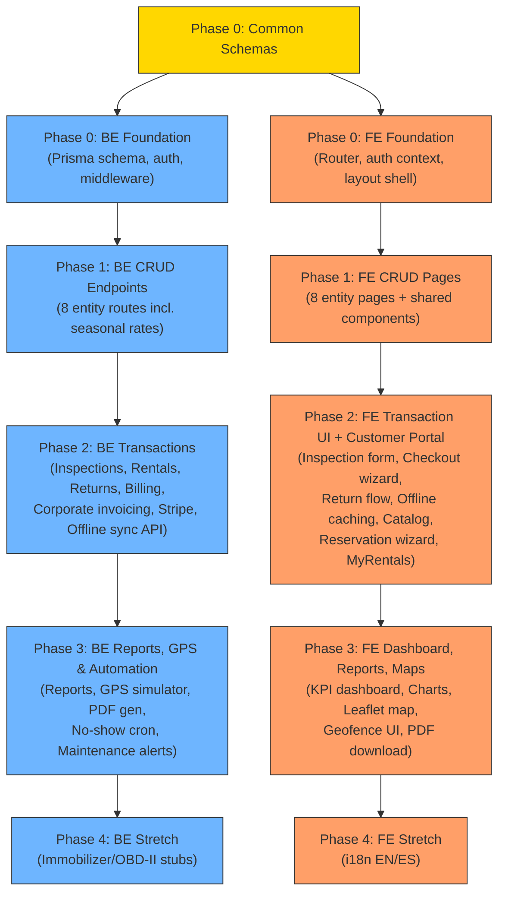

# RentCar Enterprise — Implementation Plan

Full build-out from scaffolded hello-world to production system. 3 phases, each split into **Backend (BE)** and **Frontend (FE)** tracks that can run in parallel once API contracts are agreed.

---

## Architecture Decisions

| Decision | Choice | Rationale |
|----------|--------|-----------|
| Auth | JWT (access + refresh tokens) | Already have JWT_SECRET in .env, stateless |
| Password hashing | bcryptjs | No native deps, works on Windows |
| Validation | Zod schemas in `@rent-car/common` | Shared between BE validation middleware + FE form validation |
| API pattern | RESTful with `/api/<resource>` | Simple, matches existing health endpoint |
| Backend layers | Domain → Application → Infrastructure → Presentation | Clean Architecture, folders already started |
| Frontend routing | React Router v7 | Standard, supports nested layouts |
| Frontend state | React Query (TanStack Query) | Server-state caching, auto-refetch, loading/error states |
| Form handling | React Hook Form + Zod resolver | Performant forms with shared validation |
| Payments | Stripe (real test mode) | Pre-auth holds, captures, refunds via Stripe API |
| Photo storage | Vercel Blob | Serverless-friendly, no local FS needed in prod |
| GPS | Full mock simulation + API + map UI | Fake coordinate simulator, Leaflet map dashboard |
| Maps | Leaflet + React Leaflet | Free, no API key needed, good for geofencing polygons |
| Tables | TanStack Table | Sorting, filtering, pagination built-in |
| Signature pad | react-signature-canvas | Lightweight, well-maintained |
| Charts | Recharts | Lightweight, composable, React-native |
| CSS | Tailwind v4 (already installed) | Keep existing Neo-Minimalist Liquid Glass theme |
| PDF generation | jspdf + html2canvas | Contract PDF for chargeback evidence |
| Offline caching | IndexedDB (idb library) | Offline inspection form queue for yard dead zones |
| i18n | react-i18next (Phase 4) | English/Spanish translations |

---

## Shared Contract: `@rent-car/common`

Before any phase starts, the shared package needs Zod schemas for every entity. Both agents reference these — BE uses them for request validation, FE uses them for form validation and TypeScript types.

### [MODIFY] [index.ts](file:///c:/Users/jsjer/OneDrive/Bureaublad/New%20folder/OpenSource%20II/rent-car/packages/common/src/index.ts)

Expand from just `HealthStatusSchema` to export all entity schemas, enums, and types used across phases. Organized by domain:

```
packages/common/src/
├── index.ts                  # Re-exports everything
├── schemas/
│   ├── auth.ts               # LoginSchema, RegisterSchema, CustomerRegisterSchema, TokenPayload
│   ├── vehicle-type.ts       # VehicleTypeSchema, CreateVehicleTypeSchema
│   ├── brand.ts              # BrandSchema, CreateBrandSchema
│   ├── model.ts              # ModelSchema, CreateModelSchema
│   ├── fuel-type.ts          # FuelTypeSchema, CreateFuelTypeSchema
│   ├── vehicle.ts            # VehicleSchema, CreateVehicleSchema (includes imageUrl)
│   ├── customer.ts           # CustomerSchema, CreateCustomerSchema (includes license fields + userId FK)
│   ├── employee.ts           # EmployeeSchema, CreateEmployeeSchema
│   ├── inspection.ts         # InspectionSchema, CreateInspectionSchema (includes mandatory fuel gauge photo)
│   ├── rental.ts             # RentalSchema, CreateRentalSchema, ReturnRentalSchema, CancelRentalSchema
│   ├── reservation.ts        # ReservationSchema, CreateReservationSchema (customer self-service)
│   ├── catalog.ts            # CatalogSearchSchema, CatalogVehicleSchema (public, no auth)
│   ├── transaction.ts        # TransactionLedgerSchema
│   ├── seasonal-rate.ts      # SeasonalRateSchema, CreateSeasonalRateSchema
│   ├── gps.ts                # GpsLogSchema, GeofenceSchema
│   └── health.ts             # Existing HealthStatusSchema (moved here)
└── enums.ts                  # All string enums — see full list below
```

**`enums.ts` must define all status values explicitly:**
```typescript
export const VehicleStatus = ['AVAILABLE', 'RENTED', 'UNDER_INSPECTION', 'MAINTENANCE', 'RETIRED'] as const;
export const CleaningStatus = ['CLEAN', 'DIRTY'] as const;
export const CustomerStatus = ['ACTIVE', 'SUSPENDED', 'BLACKLISTED'] as const;
export const RentalStatus = ['PENDING', 'ACTIVE', 'COMPLETED', 'CANCELLED', 'NO_SHOW'] as const;
export const InspectionStatus = ['PASSED', 'FLAGGED'] as const;
export const FuelLevel = ['EMPTY', 'QUARTER', 'HALF', 'THREE_QUARTERS', 'FULL'] as const;
export const WorkingShift = ['MORNING', 'AFTERNOON', 'NIGHT'] as const;
export const CustomerType = ['INDIVIDUAL', 'CORPORATE'] as const;
export const TransactionType = ['PRE_AUTH_HOLD', 'CHARGE', 'REFUND', 'PO_INVOICE'] as const;
export const UserRole = ['CUSTOMER', 'INSPECTOR', 'AGENT', 'ADMINISTRATOR'] as const;
export const EntityStatus = ['ACTIVE', 'INACTIVE'] as const;
```

> [!IMPORTANT]
> The common package schemas are the **API contract**. Both agents must reference them. Build this first before splitting into parallel tracks.

---

## Phase 0: Foundation (Sequential — before parallel work)

Must be done first. Sets up auth, DB schema, routing shell, and shared schemas.

---

### Phase 0 — Backend Track

#### [MODIFY] [schema.prisma](file:///c:/Users/jsjer/OneDrive/Bureaublad/New%20folder/OpenSource%20II/rent-car/apps/backend/prisma/schema.prisma)
- Replace single `User` model with **full schema** from requirements doc (all 14 models)
- Models: `User`, `VehicleType`, `Brand`, `Model`, `FuelType`, `Vehicle`, `Customer`, `Employee`, `Inspection`, `Rental`, `TransactionLedger`, `GpsLog`, `Geofence`, `SeasonalRate`
- **Customer model additions** (per §12.6): `licenseNumber`, `licenseCountry`, `licenseExpDate`, `licensePhotoUrl`
- **Customer ↔ User link**: add `userId` FK on Customer model (optional — walk-in customers may not have a User account; online customers always do)
- **Vehicle model additions**: `imageUrl` (vehicle photo for catalog), `lastMaintenanceOdometer` (for §10 maintenance alert threshold)
- **Inspection model photos**: Store inspection photos (including the dashboard fuel gauge photo) inside the general `photoUrls` JSON string array instead of a separate database column.
- **Rental model additions**: `stripePaymentIntentId`, `purchaseOrderNumber` (for corporate)
- **Rental status enum**: `PENDING` (reserved, awaiting pickup), `ACTIVE`, `COMPLETED`, `CANCELLED`, `NO_SHOW`
- **New SeasonalRate model** (per §12.11): `id`, `name`, `startDate`, `endDate`, `multiplier`, `status`
- Run `prisma migrate dev` to create tables

#### [NEW] `apps/backend/src/Domain/` layer
```
Domain/
├── entities/          # TypeScript interfaces mirroring Prisma models
├── repositories/      # Repository interfaces (abstractions)
└── errors/            # Custom error classes (NotFoundError, ValidationError, ConflictError)
```

#### [NEW] `apps/backend/src/Application/` layer
```
Application/
├── middleware/
│   ├── auth.middleware.ts          # JWT verification, role extraction, attaches user to req
│   ├── require-role.middleware.ts  # Role guard: requireRole('ADMIN', 'AGENT') — returns 403 if role mismatch
│   ├── validation.middleware.ts   # Generic Zod validation middleware
│   └── error-handler.middleware.ts # Centralized error → HTTP response mapping
└── services/
    └── auth.service.ts            # Register, login, customer self-register, token refresh, password hashing
```

#### [NEW] `apps/backend/src/Infrastructure/repositories/`
- Prisma-based implementations of repository interfaces
- One file per entity (e.g., `prisma-vehicle-type.repository.ts`)

#### [NEW] `apps/backend/src/Presentation/routes/auth.routes.ts`

| Method | Endpoint | Body | Response | Auth |
|--------|----------|------|----------|------|
| `POST` | `/api/auth/register` | `{ email, password, role }` | `{ user, accessToken, refreshToken }` | None |
| `POST` | `/api/auth/login` | `{ email, password }` | `{ user, accessToken, refreshToken }` | None |
| `POST` | `/api/auth/refresh` | `{ refreshToken }` | `{ accessToken }` | None |
| `GET` | `/api/auth/me` | — | `{ user }` | Bearer |

#### [MODIFY] [server.ts](file:///c:/Users/jsjer/OneDrive/Bureaublad/New%20folder/OpenSource%20II/rent-car/apps/backend/src/Presentation/server.ts)
- Register error handler middleware
- Mount auth routes
- Add `express.json()` body parsing (verify if already present)

#### [MODIFY] [.env](file:///c:/Users/jsjer/OneDrive/Bureaublad/New%20folder/OpenSource%20II/rent-car/.env)
Add the following env vars:
```
STRIPE_SECRET_KEY=sk_test_...
STRIPE_PUBLISHABLE_KEY=pk_test_...
BLOB_READ_WRITE_TOKEN=<vercel blob token>
```

#### [NEW] `apps/backend/prisma/seed.ts` — Database seed script
Populates dev DB with test data for both agents to work against:
- 2 admin Users, 2 agent Users, 1 inspector User, 2 customer Users
- 5 Vehicle Types (Compact, SUV, Sedan, Sport, Cargo)
- 6 Brands (Toyota, Honda, BMW, Tesla, Ford, Kia) with 2-3 Models each
- 4 Fuel Types (Regular Gas, Diesel, Hybrid, Electric)
- 10 Vehicles across various types/brands with images
- 5 Customers (3 Individual, 2 Corporate) with license info
- 4 Employees across shifts
- 2 SeasonalRate entries (Holiday +40%, Off-season -15%)
- 1 sample Geofence (Santo Domingo metro area polygon)

Run via: `npx prisma db seed` (add `"prisma": { "seed": "tsx prisma/seed.ts" }` to backend package.json)

---

### Phase 0 — Frontend Track

#### [NEW] Install dependencies
```bash
npm install react-router-dom@7 @tanstack/react-query react-hook-form @hookform/resolvers
```

#### [NEW] `apps/frontend/src/Presentation/layouts/`
```
layouts/
├── AdminLayout.tsx       # Sidebar + topbar + main content area + theme toggle (staff portal)
├── CustomerLayout.tsx    # Public-facing nav bar + footer (customer portal)
├── AuthLayout.tsx        # Centered card layout for login/register
└── Sidebar.tsx           # Staff navigation links grouped by module
```

**Route structure:**
- `/` → Customer-facing portal (CustomerLayout)
- `/admin/*` → Staff portal (AdminLayout, requires AGENT/INSPECTOR/ADMIN role)
- `/auth/*` → Login/Register (AuthLayout)

#### [NEW] `apps/frontend/src/Presentation/pages/`
```
pages/
├── LoginPage.tsx          # Shared login (role determines redirect: customer → /, staff → /admin)
├── RegisterPage.tsx       # Customer self-registration (public)
└── DashboardPage.tsx      # Admin dashboard (replaces current App.tsx health display)
```

#### [NEW] `apps/frontend/src/Infrastructure/`
```
Infrastructure/
├── api-client.ts         # Axios/fetch wrapper with JWT interceptor (auto-attach token, auto-refresh on 401)
├── auth.context.tsx      # React context for current user, login/logout actions, token storage, role-based redirects
└── query-client.ts       # TanStack Query client config
```

#### [MODIFY] [main.tsx](file:///c:/Users/jsjer/OneDrive/Bureaublad/New%20folder/OpenSource%20II/rent-car/apps/frontend/src/main.tsx)
- Wrap app in `QueryClientProvider`, `AuthProvider`, `BrowserRouter`

#### [MODIFY] [App.tsx](file:///c:/Users/jsjer/OneDrive/Bureaublad/New%20folder/OpenSource%20II/rent-car/apps/frontend/src/Presentation/App.tsx)
- Replace single-page health check with React Router `<Routes>` setup
- Route split: `/` customer layout, `/admin` staff layout, `/auth` auth layout
- Role-based guards: customer routes allow CUSTOMER role, admin routes require AGENT/INSPECTOR/ADMIN

---

## Phase 1: Core Catalog MVP

CRUD for all catalog entities + customer/employee management. After Phase 0 is done, BE and FE can work fully in parallel.

---

### Phase 1 — Backend Track

All CRUD endpoints follow the same pattern. For each entity:

| Method | Endpoint | Auth | Description |
|--------|----------|------|-------------|
| `GET` | `/api/<resource>` | Bearer | List all (with `?status=`, `?search=`, `?page=`, `?limit=` query params) |
| `GET` | `/api/<resource>/:id` | Bearer | Get by ID |
| `POST` | `/api/<resource>` | Bearer + Role | Create (validates with Zod schema from common) |
| `PUT` | `/api/<resource>/:id` | Bearer + Role | Update |
| `PATCH` | `/api/<resource>/:id/status` | Bearer + Role | Toggle status (Active/Inactive) |

#### Entities & route files to create:

| # | Entity | Route File | Allowed Roles (Write) | Validations |
|---|--------|------------|----------------------|-------------|
| 1 | Vehicle Types | `vehicle-type.routes.ts` | ADMINISTRATOR | Name unique |
| 2 | Brands | `brand.routes.ts` | ADMINISTRATOR | Name unique |
| 3 | Models | `model.routes.ts` | ADMINISTRATOR | Brand FK exists, name+brand unique |
| 4 | Fuel Types | `fuel-type.routes.ts` | ADMINISTRATOR | Name unique |
| 5 | Vehicles | `vehicle.routes.ts` | ADMINISTRATOR | VIN 17 chars unique, plate unique, engine# unique, odometer ≥ 0, imageUrl, all FKs exist & active |
| 6 | Customers | `customer.routes.ts` | AGENT, ADMINISTRATOR | National ID unique, credit limit ≥ 0, license expiry required, license photo upload, optional userId FK |
| 7 | Employees | `employee.routes.ts` | ADMINISTRATOR | National ID unique, commission 0–100, hire date ≤ today |
| 8 | Seasonal Rates | `seasonal-rate.routes.ts` | ADMINISTRATOR | Date ranges non-overlapping, multiplier > 0 |

**Vehicle cleaning management** (§Pipeline Phase 6):

| Method | Endpoint | Auth | Description |
|--------|----------|------|-------------|
| `PATCH` | `/api/vehicles/:id/cleaning` | INSPECTOR, ADMIN | Set cleaning status: `DIRTY` → `CLEAN`. When set to `CLEAN`, auto-updates vehicle status from `DIRTY` to `AVAILABLE` (unless `MAINTENANCE` flagged) |

#### [NEW] Per entity:
```
Application/services/<entity>.service.ts       # Business logic, validation orchestration
Infrastructure/repositories/prisma-<entity>.repository.ts
Presentation/routes/<entity>.routes.ts          # Express router
```

#### [NEW] `Presentation/routes/index.ts`
- Central router that mounts all sub-routers under `/api/`

---

### Phase 1 — Frontend Track

For each entity, create a **list page** and a **form modal/page**. All follow a consistent pattern using shared components:

#### [NEW] Shared UI components
```
Presentation/components/
├── ui/
│   ├── DataTable.tsx          # TanStack Table wrapper — sortable, filterable, paginated
│   ├── FormModal.tsx          # Reusable modal shell with header, body, footer
│   ├── FormField.tsx          # Label + input + error message wrapper
│   ├── SelectField.tsx        # Dropdown with async options loading
│   ├── StatusBadge.tsx        # Colored badge for Active/Inactive/Rented/etc.
│   ├── ConfirmDialog.tsx      # "Are you sure?" modal
│   ├── SearchBar.tsx          # Debounced search input
│   ├── PageHeader.tsx         # Title + description + action button
│   ├── LoadingSpinner.tsx     # Existing spinner extracted
│   └── Toast.tsx              # Success/error notifications
├── guards/
│   └── ProtectedRoute.tsx     # Role-based route guard
└── hooks/
    ├── useDebounce.ts
    └── usePagination.ts
```

#### [NEW] Entity pages (one folder per entity):
```
pages/
├── vehicle-types/
│   ├── VehicleTypesPage.tsx          # DataTable + "Add" button
│   └── VehicleTypeForm.tsx           # Create/Edit form modal
├── brands/
│   ├── BrandsPage.tsx
│   └── BrandForm.tsx
├── models/
│   ├── ModelsPage.tsx
│   └── ModelForm.tsx
├── fuel-types/
│   ├── FuelTypesPage.tsx
│   └── FuelTypeForm.tsx
├── vehicles/
│   ├── VehiclesPage.tsx              # Rich table with status badges, filters
│   └── VehicleForm.tsx               # Complex form: cascading Brand → Model selects
├── customers/
│   ├── CustomersPage.tsx
│   └── CustomerForm.tsx              # Individual/Corporate toggle, license fields, license photo upload
├── employees/
│   ├── EmployeesPage.tsx
│   └── EmployeeForm.tsx              # Shift selector, commission slider, date picker
└── seasonal-rates/
    ├── SeasonalRatesPage.tsx          # Calendar view of rate multipliers
    └── SeasonalRateForm.tsx           # Date range picker + multiplier input
```

#### [NEW] API hooks (TanStack Query):
```
Infrastructure/hooks/
├── useVehicleTypes.ts    # useQuery + useMutation for CRUD
├── useBrands.ts
├── useModels.ts
├── useFuelTypes.ts
├── useVehicles.ts         # Includes cleaning status mutation
├── useCustomers.ts
├── useEmployees.ts
└── useSeasonalRates.ts
```

#### [MODIFY] Sidebar navigation
- Add links for each entity grouped under "Fleet Catalog", "People", and "Pricing" sections

---

## Phase 2: Transaction MVP

Inspections, rental booking, returns with penalty calculation, e-signatures, corporate invoicing, offline support, **customer-facing online portal**.

---

### Phase 2 — Backend Track

#### [NEW] Public catalog endpoint — `catalog.routes.ts`

| Method | Endpoint | Auth | Description |
|--------|----------|------|-------------|
| `GET` | `/api/catalog/vehicles` | None | Public vehicle search: `?type=&brand=&dateFrom=&dateTo=&seats=&fuelType=`. Returns only `AVAILABLE` vehicles with no date conflicts |
| `GET` | `/api/catalog/vehicles/:id` | None | Vehicle detail with photos, specs, daily rate (applies seasonal multiplier for requested dates) |
| `GET` | `/api/catalog/vehicle-types` | None | List active vehicle types (for filter dropdowns) |
| `GET` | `/api/catalog/brands` | None | List active brands (for filter dropdowns) |

#### [NEW] Customer self-service endpoints — additions to `rental.routes.ts` and `customer.routes.ts`

| Method | Endpoint | Auth | Description |
|--------|----------|------|-------------|
| `POST` | `/api/auth/register/customer` | None | Customer self-registration (name, email, password, national ID, license, credit card via Stripe) |
| `GET` | `/api/customers/me` | CUSTOMER | Get own profile |
| `PUT` | `/api/customers/me` | CUSTOMER | Update own profile |
| `POST` | `/api/reservations` | CUSTOMER | Create reservation (vehicle, dates) → status `PENDING`, places Stripe hold |
| `GET` | `/api/reservations/me` | CUSTOMER | List own reservations/rentals |
| `POST` | `/api/reservations/:id/cancel` | CUSTOMER | Cancel own reservation (applies cancellation fee logic §12.5) |

**Reservation service logic:**
1. Validate vehicle is `AVAILABLE` and no date overlap
2. Validate customer not blacklisted/suspended
3. Validate license not expired for rental period
4. Apply seasonal pricing
5. Place Stripe pre-auth hold (or upfront capture if > 7 days)
6. Create rental with status `PENDING` — awaits yard pickup
7. Trigger §12.7: 2-hour no-show window starts at `rentalDate`

#### [NEW] Inspection endpoints — `inspection.routes.ts`

| Method | Endpoint | Auth | Description |
|--------|----------|------|-------------|
| `GET` | `/api/inspections` | Bearer | List with filters (vehicle, customer, date range, status) |
| `GET` | `/api/inspections/:id` | Bearer | Get by ID with vehicle/customer/employee relations |
| `POST` | `/api/inspections` | INSPECTOR, ADMIN | Create inspection — validates vehicle exists, sets vehicle status to `UNDER_INSPECTION` |

**Business logic in service:**
- Auto-set `inspectionDate` to now
- Determine `status`: if `hasBrokenGlass || hasScratches || any tire bad` → `FLAGGED`, else `PASSED`
- Store photo URLs as JSON string array
- **Mandatory fuel gauge photo** (§12.9): verified via the general inspection photos array (`photoUrls`), ensuring at least one photo (representing the fuel gauge/dashboard cluster) is uploaded.

#### [NEW] Rental endpoints — `rental.routes.ts`

| Method | Endpoint | Auth | Description |
|--------|----------|------|-------------|
| `GET` | `/api/rentals` | Bearer | List with filters (customer, vehicle, date range, status, employee) |
| `GET` | `/api/rentals/:id` | Bearer | Get by ID with all relations |
| `POST` | `/api/rentals` | AGENT, ADMIN | Create rental contract |
| `POST` | `/api/rentals/:id/return` | AGENT, ADMIN | Process return |
| `POST` | `/api/rentals/:id/cancel` | AGENT, ADMIN | Cancel pending rental |
| `POST` | `/api/rentals/:id/sign` | AGENT, ADMIN | Attach e-signature data |

**Rental creation service logic:**
1. **Wrap in Prisma `$transaction` with serializable isolation** (§9 — prevent double-booking race)
2. Validate vehicle status = `AVAILABLE` and cleaning = `CLEAN`
3. Validate no date overlap with existing active rentals for same vehicle
4. Validate customer status ≠ `BLACKLISTED` or `SUSPENDED`
5. **Validate driver's license not expired** (§12.6): `licenseExpDate > scheduledReturnDate`
6. **Corporate vs Individual split** (§12.10):
   - **Individual**: credit limit check → Stripe pre-auth hold
   - **Corporate**: require `purchaseOrderNumber`, deduct from credit line, skip Stripe hold
7. **Apply seasonal pricing** (§12.11): `effectiveRate = baseRate × seasonalMultiplier` for each day
8. Calculate `totalCost = Σ(effectiveRate per day)`
9. Validate checkout inspection exists and status = `PASSED`
10. Create rental record, set vehicle status → `RENTED`
11. Create `TransactionLedger` entry (type: `PRE_AUTH_HOLD` or `PO_INVOICE`)

**Cancellation logic** (§12.5):
- `> 24 hrs` before pickup: free cancellation, release Stripe hold
- `< 24 hrs` or no-show: charge flat 1-day rental fee via Stripe capture
- Status → `CANCELLED`

**Return processing service logic:**
1. Validate `returnOdometer ≥ checkoutOdometer`
2. Validate `actualReturnDate ≥ rentalDate`
3. **Odometer fraud alert** (§12.4): if `(returnOdometer - checkoutOdometer) / actualDays > 1000`, flag warning (still allow, but log alert)
4. Calculate **late fee** (§C in analysis doc):
   - Grace: 59 min
   - ≤ 4 hrs late: `hours × 0.15 × dailyRate`
   - \> 4 hrs late: `dailyRate + $50 flat`
5. Calculate **refueling penalty** (§C):
   - Map fuel levels to fractions: EMPTY=0, QUARTER=1, HALF=2, THREE_QUARTERS=3, FULL=4
   - `missingFractions = checkoutLevel - returnLevel`
   - `penalty = missingFractions × $25`
6. Calculate **damage penalty** (§D):
   - Per damaged tire: $120
   - Broken glass: $250
   - New scratches (minor < 3in): $75, (major ≥ 3in): vehicle → `MAINTENANCE` + custom claim
7. `totalCost = Σ(effectiveRate per day) + lateFee + refuelPenalty + damagePenalty`
8. Update rental status → `COMPLETED`, vehicle status → `DIRTY`
9. Create `TransactionLedger` entry (type: `CHARGE`)
10. **Trigger maintenance alert** (§10) if vehicle odometer > 5000 since last service

> [!NOTE]
> **No-delete policy** (§9): Rental records have no DELETE endpoint. Only status transitions (ACTIVE → COMPLETED/CANCELLED) are allowed to preserve audit trails and commission data.

#### [NEW] Hard maintenance block logic (§12.8)
When vehicle status changes to `MAINTENANCE` or `UNDER_INSPECTION`:
- Query all `PENDING` rentals for that vehicle
- Auto-cancel them, release Stripe holds
- Return suggested alternative vehicles (same type, available)

#### [NEW] `Application/services/billing.service.ts`
- Pure calculation functions for late fees, fuel penalties, damage fees
- Exported separately for unit testing

#### [NEW] Photo upload endpoint — `upload.routes.ts`

| Method | Endpoint | Auth | Description |
|--------|----------|------|-------------|
| `POST` | `/api/uploads` | Bearer | Accept multipart image, upload to Vercel Blob, return URL |
| `DELETE` | `/api/uploads` | Bearer | Delete blob by URL |

Use `multer` for multipart parsing in memory (no disk). Upload buffer to Vercel Blob via `@vercel/blob` SDK.

```typescript
// Example flow
import { put, del } from '@vercel/blob';
const blob = await put(`inspections/${uniqueId}.jpg`, fileBuffer, { access: 'public' });
// blob.url → store in DB
```

#### [NEW] Stripe payment service — `Application/services/stripe.service.ts`

Integrates with Stripe API for the rental billing lifecycle:

| Function | Stripe API | When |
|----------|-----------|------|
| `createPreAuthHold(customerId, amount)` | `paymentIntents.create({ capture_method: 'manual' })` | Rental checkout |
| `capturePayment(paymentIntentId, amount)` | `paymentIntents.capture()` | Rental return — capture actual cost |
| `cancelHold(paymentIntentId)` | `paymentIntents.cancel()` | Rental cancellation |
| `createCustomerToken(cardDetails)` | `customers.create()` + `paymentMethods.attach()` | Customer registration |

**Pre-auth hold flow:**
1. At checkout: `holdAmount = (dailyRate × days) + securityDeposit($200 individual, $0 corporate)`
2. Place hold via Stripe `PaymentIntent` with `capture_method: 'manual'`
3. Store `paymentIntentId` in `TransactionLedger`
4. At return: capture actual amount (rental cost + penalties), Stripe auto-releases remainder
5. Log final charge in `TransactionLedger` with Stripe fee calculation

**Stripe hold re-auth** (§12.1):
- For rentals > 7 days, Stripe holds expire automatically
- Backend checks at rental creation: if `daysCount > 7`, capture funds upfront instead of hold
- Process partial refund on return if actual cost < captured amount

---

### Phase 2 — Frontend Track

#### [NEW] Inspection pages
```
pages/inspections/
├── InspectionsPage.tsx            # List of inspections with status badges
├── InspectionForm.tsx             # Full mobile-optimized checklist form
└── VehicleDamageMap.tsx           # Interactive SVG car diagram — tap to mark damage spots
```

**InspectionForm features:**
- Vehicle selector (only shows AVAILABLE vehicles)
- Customer selector
- Toggle switches for: scratches, spare tire, jack, broken glass
- 4 tire condition toggles (front-left, front-right, rear-left, rear-right)
- Fuel level radio group (E, 1/4, 1/2, 3/4, Full) with visual gauge
- Odometer numeric input with validation
- **Mandatory fuel gauge photo** (§12.9): camera button to photograph dashboard cluster, required before submit
- Photo upload area (drag & drop + camera capture on mobile)
- Mobile-first responsive layout matching the ASCII wireframe in requirements doc
- **Offline mode** (§12.3): form saves to IndexedDB when offline, shows "Queued" badge, auto-syncs when network returns

#### [NEW] Rental pages
```
pages/rentals/
├── RentalsPage.tsx                # List with status filters, search
├── RentalCheckoutForm.tsx         # Multi-step checkout wizard
├── RentalReturnForm.tsx           # Return processing form with live cost calculator
└── RentalDetailPage.tsx           # Full contract view with all data
```

**RentalCheckoutForm (multi-step wizard):**
1. **Step 1 — Customer:** Select customer, show credit status, block if blacklisted/suspended, **verify license not expired** (§12.6)
2. **Step 2 — Vehicle:** Select available vehicle, show details, pick dates, see **dynamic daily rate with seasonal multiplier** (§12.11)
3. **Step 3 — Payment:** Individual → Stripe card form, Corporate → PO number input (§12.10). Show hold amount breakdown
4. **Step 4 — Review:** Show estimated cost, credit limit check, inspection status. Note if > 7 days → upfront capture (§12.1)
5. **Step 5 — Sign:** E-signature canvas + legal consent checkbox + submit

**RentalReturnForm:**
- Select active rental
- Return inspection form (reuse InspectionForm)
- Auto-calculated penalties displayed in real-time as inspector fills fields:
  - Late fee calculator (shows hours late, rate applied)
  - Fuel difference visualizer (checkout level vs return level)
  - Damage costs itemized
- Total cost breakdown table
- E-signature capture for return acknowledgment
- Submit → triggers return API

#### [NEW] E-signature component
```
components/
└── SignaturePad.tsx        # react-signature-canvas wrapper with Clear/Undo, saves as data URL
```

#### [NEW] API hooks
```
Infrastructure/hooks/
├── useInspections.ts
├── useRentals.ts
└── useUploads.ts
```

#### [NEW] Offline sync infrastructure
```
Infrastructure/
├── offline-queue.ts       # IndexedDB wrapper using 'idb' library
│                           # Stores pending inspection payloads when offline
│                           # Auto-retries POST /api/inspections on reconnect
└── network-status.tsx     # React context: online/offline state, triggers sync
```

#### [MODIFY] Sidebar (staff portal)
- Add "Operations" section: Inspections, Rentals

#### [NEW] Customer-facing portal pages
```
pages/customer/
├── CatalogPage.tsx                # Vehicle grid with filters (type, brand, dates, price range)
│                                   # Each card: vehicle photo, name, daily rate, "Reserve" button
├── VehicleDetailPage.tsx          # Full specs, photo gallery, availability calendar, rate breakdown
├── ReservationWizard.tsx          # 3-step: Select dates → Enter/confirm payment → Confirmation
├── MyRentalsPage.tsx              # List of own reservations + active/past rentals with status badges
│                                   # Cancel button (with fee warning if < 24hrs)
│                                   # PDF contract download for completed rentals
└── MyProfilePage.tsx              # Edit name, license info, view credit status
```

**CatalogPage features:**
- Vehicle grid/list toggle with glassmorphism cards
- Filter sidebar: vehicle type, brand, fuel type, date range, price range
- Real-time availability check (grayed-out if unavailable for selected dates)
- Daily rate shows seasonal multiplier if applicable ("$50/day → $70/day holiday rate")
- Sort by: price, type, newest

**ReservationWizard:**
1. **Step 1 — Dates & Vehicle:** Confirm vehicle, select pickup/return dates, see total cost breakdown with seasonal rates
2. **Step 2 — Payment:** Stripe Elements card form (or show saved card). Display hold amount: `(rate × days) + $200 deposit`
3. **Step 3 — Confirmation:** Summary + booking reference number. "Show up at [branch] on [date] by [time]"

**MyRentalsPage:**
- Tab filters: Upcoming | Active | Completed | Cancelled
- Each card shows: vehicle, dates, cost, status badge
- Cancel button with dynamic warning: "Free cancellation" or "1-day fee ($X) applies"

#### [NEW] Stripe Elements component
```
components/
└── StripeCardForm.tsx     # @stripe/stripe-js Elements wrapper for secure card input
                            # Used in both customer reservation and admin checkout wizard
```

#### [NEW] Customer API hooks
```
Infrastructure/hooks/
├── useCatalog.ts          # Public vehicle search queries
├── useReservations.ts     # Customer's own reservations CRUD
└── useCustomerProfile.ts  # Own profile read/update
```

---

### Phase 2.1: Stripe Saved Card Wallet

This sub-phase integrates credit card reusability and customer card wallet management.

#### Backend Tracks
- **Stripe Wallet Integration (`stripe.service.ts`)**: Add methods `listCustomerCards(customerId)`, `detachPaymentMethod(paymentMethodId)`, and `getPaymentIntent(paymentIntentId)`.
- **Customer Wallet Routes (`customer.routes.ts`)**: 
  - `GET /api/customers/me/payment-methods` (retrieve logged-in customer's wallet)
  - `DELETE /api/customers/me/payment-methods/:paymentMethodId` (detach card)
  - Staff-facing routes: `GET /api/customers/:id/payment-methods` and `DELETE /api/customers/:id/payment-methods/:paymentMethodId` for counter agents.
- **Card Deletion Block Validation (`catalog.service.ts`)**: Throws a validation error if a customer attempts to delete a card associated with an active/pending rental check-out.

#### Frontend Tracks
- **TanStack Hooks (`useCatalog.ts`)**: Export `useMyPaymentMethods`, `useCustomerPaymentMethods`, `useDeleteMyPaymentMethod`, and `useDeleteCustomerPaymentMethod`.
- **Checkout Integrations (`CatalogPage.tsx` & `ReservationsPage.tsx`)**: Allow choosing from cards on file (via Stripe Customer ID query) or typing a new card. Render "Remove" buttons to detach cards from the wallet.

---

### Phase 2.2: Role-based UI Action Conditioning

Restricts frontend UI rendering based on the user's role, mirroring the backend auth permissions.

#### Frontend Tracks
- **Context Binding (`ReservationsPage.tsx`)**: Limit walk-in counter bookings and checkout flow transitions only to authorized staff (`AGENT` or `ADMINISTRATOR`). Hide actions for the `INSPECTOR` role.
- **Visual Sidebar Filtering (`Sidebar.tsx`)**: Group layout routing dynamically. Hide configuration submenus (Seasonal Rates, Employees, Fees) from `AGENT` roles and restrict `INSPECTOR` views to Dashboard, Vehicles, Inspections, and Reservations.
- **Router Route Interceptors (`AdminLayout.tsx`)**: Handle manual URL entry. Intercept unauthorized page accesses based on the user's role and redirect to `/admin`.

---

### Phase 2.3: Idle Session Rejection & Dashboard Performance

Implements API retry queue rejections on session expiration and resolves redundant queries.

#### Frontend Tracks
- **Promise Rejection Queue (`api-client.ts`)**: Refactor request buffer queue with both resolve and reject handlers. Reject all pending requests in the queue immediately with a `Session expired` error if refresh tokens fail, preventing loading hangs.
- **Enabled Query Checks (`useDashboard.ts` & `DashboardPage.tsx`)**: Add conditional check parameters to `useAdminDashboard` and `useCustomerDashboard` queries to only fire them if the matching role (`isAdmin` vs `!isAdmin`) is authenticated.

---

### Phase 2.4: Walk-in Stepper Wizard & Tariff Lookup

Splits counter booking into a multi-step stepper wizard and implements dynamic price checks.

#### Frontend Tracks
- **Stepper Structure (`ReservationsPage.tsx`)**:
  - **Step 1 (Parameters)**: Choose active customer, vehicle, dates, and read-only daily rate.
  - **Step 2 (Stripe Wallet)**: Load cards on file or input a new card.
  - **Step 3 (Signature)**: Capture checkout signature.
  - **Step 4 (Success)**: Confirmation screen.
- **Dynamic Tariff Selector (`ReservationsPage.tsx`)**: cascade lookup of vehicle `baseDailyRate` from `vehicleType` lookup collections. Form input is set to read-only/disabled to prevent counter agents from manually overriding tariffs.
- **i18n Mappings**: Add translations for step names, progress subtitles, and walk-in details.

---

### Phase 2.5: Customer Form Realignment & Secure Uploader

Removes obsolete input fields, splits customer creation, and adds live document camera uploads.

#### Frontend Tracks
- **Card Number Input Removal (`CustomersPage.tsx`)**: Remove raw `creditCardNumber` text input fields from customer CRUD configurations (as Stripe Card Elements handles card tokens). Let `creditLimit` take up full width.
- **Webcam Snapshot Capture (`LicensePhotoCapture.tsx`)**: 
  - Create high-fidelity uploader supporting MediaDevices camera streams and canvas snapshot capture.
  - Convert captured video frames to JPEG Files and upload them directly to `/api/uploads` Vercel Blob storage.
- **Stepped Customer Form (`CustomersPage.tsx`)**: Split the CRUD modal into a 2-step stepper:
  - **Step 1 (General Info)**: Name, National ID, Customer Type (Corporate/Individual), and Credit Limit (rendered only for Corporate accounts).
  - **Step 2 (Driver Credentials)**: License Number, Country, Expiry Date, and `<LicensePhotoCapture />`.
- **Checkout Enforcement (`ReservationsPage.tsx`)**: Enforce `licensePhotoUrl` checking in checkout checks. If the document photo is missing, the agent is forced to capture it before checking out the vehicle.

---

### Phase 2.5.1: Customer Form & Walk-in Checkout Validation Polish

Applies camera stream refinements, strict expiration dates, and localized errors.

#### Frontend Tracks
- **Rear Camera Soft Preference (`LicensePhotoCapture.tsx`)**: Update camera constraints to `{ facingMode: { ideal: 'environment' } }` to prioritize rear cameras on mobile but fallback gracefully to laptop webcams without throwing overconstraint errors.
- **Customer Expiry Guard (`CustomersPage.tsx`)**: Validate that `licenseExpDate` is in the future.
- **Counter Walk-in Checks (`ReservationsPage.tsx`)**: Output descriptive localized errors (`common.fieldsRequired`) when validation fields are left blank.

---

### Phase 2.6: Vehicle Image Upload & Secure Proxying

Integrates vehicle file uploading on save and wraps image render paths to secure private blob assets.

#### Frontend Tracks
- **Uploader Integration (`VehiclesPage.tsx`)**:
  - Replace raw image URL text input with `<FileUploader>` supporting camera capture and drag-and-drop.
- **Upload-on-Save Logic (`VehiclesPage.tsx`)**:
  - In edit mode: uploads the selected file before saving, utilizing `editingItem.id` as `entityId`.
  - In create mode: creates the vehicle first to obtain its auto-generated database ID, uploads the file using `created.id` as `entityId`, and then updates the vehicle's `imageUrl`.
  - Tie loading state to Save button spinner.
- **Proxy Image Wrapping (`getImageProxyUrl`)**:
  - Wrap image renders with `getImageProxyUrl` across `VehiclesPage.tsx` (table thumbnail), `CatalogPage.tsx` (catalog grid cards and checkout reviews), `MyRentalsPage.tsx` (rental history), and `ReservationsPage.tsx` (staff logs) to ensure Vercel Blobs load via the backend proxy.

---

## Phase 3: Reporting, Scale & Automation

Query dashboard, reports, commission tracking, GPS, PDF contracts, background jobs.

---

### Phase 3 — Backend Track

#### [NEW] Query/search endpoint — `query.routes.ts`

| Method | Endpoint | Auth | Description |
|--------|----------|------|-------------|
| `GET` | `/api/rentals/search` | Bearer | Advanced search: `?customerName=&vehicleType=&dateFrom=&dateTo=&employee=&status=` |

Returns paginated results with joined customer, vehicle, and employee data.

#### [NEW] Reports endpoints — `report.routes.ts`

| Method | Endpoint | Auth | Description |
|--------|----------|------|-------------|
| `GET` | `/api/reports/utilization` | ADMIN | Fleet utilization rate by date range |
| `GET` | `/api/reports/revenue` | ADMIN | Revenue grouped by vehicle type + date range |
| `GET` | `/api/reports/commissions` | ADMIN | Employee commissions for date range |

**Utilization formula:**
```
utilizationRate = totalRentedDays / (totalVehicles × daysInRange) × 100
```

**Commission calculation:**
```
commission = rental.totalCost × (employee.commissionPercentage / 100)
```

#### [NEW] GPS endpoints (stretch) — `gps.routes.ts`

| Method | Endpoint | Auth | Description |
|--------|----------|------|-------------|
| `GET` | `/api/vehicles/:id/gps` | Bearer | Latest GPS position for vehicle |
| `GET` | `/api/vehicles/:id/gps/history` | Bearer | GPS trail for date range |
| `POST` | `/api/vehicles/:id/gps` | SYSTEM | Ingest GPS data point (from IoT device / simulator) |
| `GET` | `/api/gps/active` | Bearer | All currently rented vehicles with latest positions |
| `GET` | `/api/geofences` | ADMIN | List geofences |
| `POST` | `/api/geofences` | ADMIN | Create geofence |
| `PUT` | `/api/geofences/:id` | ADMIN | Update geofence |
| `DELETE` | `/api/geofences/:id` | ADMIN | Delete geofence |

#### [NEW] GPS mock simulator — `Application/services/gps-simulator.service.ts`

Background service that generates fake telemetry for all `RENTED` vehicles:

- On backend startup (dev mode only), spawns an interval (every 5 seconds)
- For each rented vehicle, generates a new GPS point:
  - Starts from a random base coordinate (e.g., Santo Domingo area: 18.47°N, 69.93°W)
  - Each tick: random walk ± 0.001° lat/lng, speed 20–80 km/h, heading based on direction
  - Fuel level decreases gradually over time
  - Odometer increments proportional to speed
- Inserts `GpsLog` records into DB
- Checks geofence boundaries: if vehicle exits any active geofence polygon, logs a warning (future: webhook alert)

**Geofence boundary check** — point-in-polygon algorithm:
```typescript
function isInsideGeofence(lat: number, lng: number, polygon: [number, number][]): boolean {
  // Ray-casting algorithm
}
```

#### [NEW] `Application/services/report.service.ts`
- Aggregation queries using Prisma `groupBy`, `aggregate`
- Date range filtering

#### [NEW] PDF contract generator — `Application/services/pdf.service.ts` (§12.2)
Generates chargeback-evidence PDF containing:
1. Checkout inspection checklist + all photos
2. Return inspection checklist + all photos
3. Both e-signatures (checkout + return) with metadata (IP, user-agent, timestamp)
4. Rental terms, cost breakdown, penalty itemization

Uses `pdfkit` or `jspdf` server-side. Stored in Vercel Blob. URL saved on rental record.

Endpoint:

| Method | Endpoint | Auth | Description |
|--------|----------|------|-------------|
| `GET` | `/api/rentals/:id/contract-pdf` | Bearer | Generate & return PDF (or return cached URL) |

#### [NEW] Background scheduled jobs — `Application/jobs/`

| Job | Schedule | Logic | Ref |
|-----|----------|-------|-----|
| **No-show auto-release** | Every 15 min | Find `PENDING` rentals where `rentalDate + 2hrs < now`. Mark `NO_SHOW`, revert vehicle to `AVAILABLE`, charge 1-day fee via Stripe | §12.7 |
| **Maintenance alerts** | On every return | If `vehicle.currentOdometer - lastMaintenanceOdometer > 5000`, set vehicle status to `MAINTENANCE`, log alert | §10 |

Implement using `node-cron` (lightweight, no external deps). Starts with server in dev mode.

---

### Phase 3 — Frontend Track

#### [NEW] Dashboard page (replaces placeholder)
```
pages/dashboard/
├── DashboardPage.tsx              # KPI cards + charts
├── KpiCard.tsx                    # Stat card (total vehicles, active rentals, revenue today, etc.)
└── FleetStatusChart.tsx           # Donut chart of vehicle statuses
```

#### [NEW] Query page
```
pages/query/
└── RentalQueryPage.tsx            # Advanced filter form + results DataTable + export button
```

**Filters:** Customer name, vehicle type, date range, authorizing employee, status.
**Features:** Real-time filtering, CSV export, print view, **PDF contract download button** per rental row.

#### [NEW] Reports pages
```
pages/reports/
├── UtilizationReportPage.tsx      # Date range picker → utilization % per vehicle + bar chart
├── RevenueReportPage.tsx          # Revenue grouped by vehicle type, line chart over time
└── CommissionsReportPage.tsx      # Employee commission table with totals
```

Charts: use a lightweight library like **Recharts** or **Chart.js**.

#### [NEW] GPS pages
```
pages/gps/
├── GpsMapPage.tsx                 # Leaflet live map with vehicle markers
├── GeofenceConfigPage.tsx         # Draw/edit polygons on map, manage geofence rules
└── VehicleTrailPage.tsx           # Historical GPS trail for a single vehicle
```

**GpsMapPage features:**
- Full-screen Leaflet map centered on fleet area
- Auto-refreshing markers (poll `/api/gps/active` every 5s) for all rented vehicles
- Each marker shows: vehicle plate, speed, heading arrow, last update time
- Click marker → popup with vehicle details + link to trail history
- Color-coded markers: green = moving, yellow = idle, red = outside geofence

**GeofenceConfigPage features:**
- Leaflet Draw plugin for creating polygon boundaries
- List of existing geofences with toggle active/inactive
- Alert contact email per geofence
- Visual overlay of geofence polygons on map

**VehicleTrailPage features:**
- Date range picker
- Polyline trail on map showing vehicle path
- Speed chart over time (Recharts line chart below map)

#### [MODIFY] Sidebar
- Add "Analytics" section: Query, Reports (sub-items: Utilization, Revenue, Commissions)
- Add "Tracking" section: Live Map, Geofences

---

## Phase 4: Stretch & Polish

Hardware API stubs, i18n, final polish.

---

### Phase 4 — Backend Track

#### [NEW] Hardware API stubs (§FR-5.3, §FR-5.4)

| Method | Endpoint | Auth | Description |
|--------|----------|------|-------------|
| `POST` | `/api/vehicles/:id/immobilizer` | ADMIN | Remote lock/unlock/disable — stub returns mock success. Ready for real telematics hardware integration |
| `GET` | `/api/vehicles/:id/obd` | INSPECTOR, ADMIN | OBD-II diagnostic read — stub returns mock fuel + odometer from latest GpsLog |

These are placeholder endpoints that return simulated data. The API contract is defined so that when real telematics hardware is integrated, only the service implementation changes.

### Phase 4 — Frontend Track

#### [NEW] i18n support (§11 Phase 3)
```
Infrastructure/
└── i18n/
    ├── i18n.ts               # react-i18next config, language detector
    ├── en.json               # English translations
    └── es.json               # Spanish translations
```

- Wrap app in `I18nextProvider`
- Add language toggle in topbar (EN/ES)
- Extract all user-facing strings to translation keys
- Covers: form labels, button text, status labels, error messages, sidebar items

---

## Dependency & Execution Order



**Parallel tracks per phase:**
- 🔵 BE and 🟠 FE within the same phase run **in parallel**
- Phases are **sequential** (Phase 0 → 1 → 2 → 3 → 4)
- Phase 0 Common schemas must complete before BE/FE split

---

## New Dependencies to Install

### Backend
```bash
npm install bcryptjs jsonwebtoken multer stripe @vercel/blob pdfkit node-cron --workspace=apps/backend
npm install -D @types/bcryptjs @types/jsonwebtoken @types/multer @types/node-cron --workspace=apps/backend
```

### Frontend
```bash
npm install react-router-dom@7 @tanstack/react-query @tanstack/react-table react-hook-form @hookform/resolvers react-signature-canvas recharts @stripe/stripe-js leaflet react-leaflet @types/leaflet leaflet-draw @types/leaflet-draw idb react-i18next i18next --workspace=apps/frontend
npm install -D @types/react-signature-canvas --workspace=apps/frontend
```

---

## Resolved Decisions

| # | Question | Decision |
|---|----------|----------|
| 1 | GPS scope | **Full mock simulation** — fake telemetry generator on backend, Leaflet map + geofence UI on frontend |
| 2 | Photo storage | **Vercel Blob** — `@vercel/blob` SDK, multipart upload via multer (memory), public URLs stored in DB |
| 3 | Stripe | **Real test mode** — keys provided, full pre-auth hold → capture → refund lifecycle |
| 4 | Design | **Keep** existing Neo-Minimalist Liquid Glass glassmorphism theme |

---

## Verification Plan

### Per Phase
- **BE:** Run each route with test requests (can use a scratch REST client script or curl commands). Verify response shapes match Zod schemas from common package.
- **FE:** Launch dev server, manually test each CRUD flow (create, list, edit, toggle status). Verify form validation errors display correctly.
- **Integration:** Run `npm run dev` (both servers), test full flows end-to-end through the UI.

### Final
- Build check: `npm run build` passes with zero errors
- All CRUD operations work through the UI
- Rental checkout → return flow completes with correct penalty calculations
- Role-based access enforced (admin vs agent vs inspector)
- Corporate checkout with PO number (no Stripe) works
- Individual checkout with Stripe hold (> 7 day → upfront capture) works
- Cancellation fee logic: > 24hr free, < 24hr charges 1-day
- Offline inspection: disconnect network, fill form, reconnect → auto-syncs
- PDF contract generates with inspection photos + signatures
- GPS map shows simulated vehicle markers moving
- Geofence polygon draw + breach detection works
- Seasonal rate multiplier applies to daily rate calculation
- License expiry blocks checkout if expired before return date
- Maintenance alert fires when odometer threshold exceeded
- No-show auto-release flips stale pending rentals
- Customer self-registration creates User + Customer + Stripe customer
- Public catalog shows only available vehicles with seasonal pricing
- Customer reservation wizard: dates → Stripe payment → confirmation
- Customer can cancel reservation (free if > 24hr, fee if < 24hr)
- MyRentals shows own bookings with correct status badges
- Customer cannot access admin routes, admin cannot access customer-only endpoints
- Vehicle cleaning toggle (DIRTY → CLEAN) restores AVAILABLE status

---

## Phase 2.8 Update: Structured Driver Details & Corporate Validation Bypass

To align B2B corporate checkout processes with real-world requirements:
- **Prisma Schema:** Extended `Rental` model to store optional `driverName` and `driverLicenseNumber` fields.
- **Backend Service Bypasses:** Disabled driver's license expiry checks during reservation booking and customer profile completeness audits for `CORPORATE` customers, while maintaining strict rules for `INDIVIDUAL` profiles.
- **Corporate Checkout Driver Verification:** Enforce recording of physical employee driver details (`driverName` and `driverLicenseNumber`) during the Checkout Stepper and Walk-in counter flows when checking out vehicles for `CORPORATE` customer accounts.
- **Camera Document Capture:** Integrated a reusable `<LicensePhotoCapture />` component utilizing MediaDevices and Canvas APIs to capture document photos directly at the counter.
- **Zod Schema Refinements:** Split validation schemas to support nullable driver's license fields for corporate accounts while enforcing strict requirements for individuals.
- **Corporate Stepper Bypass:** Refactored the customer creation/edit flow to bypass the driving credentials step entirely when `type === 'CORPORATE'` is selected.
