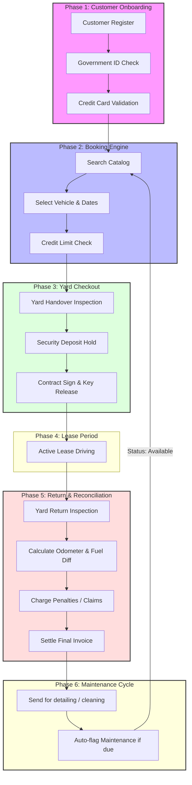
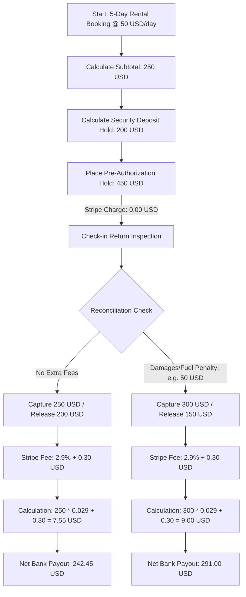
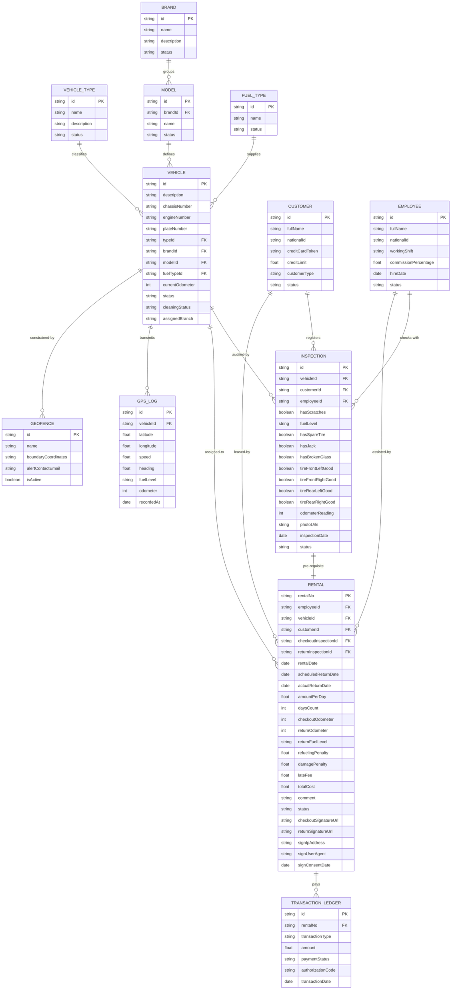
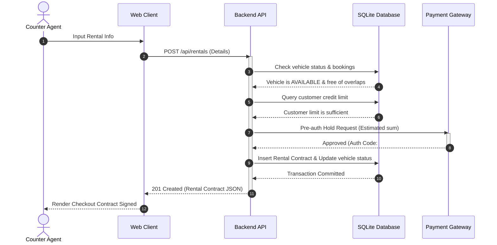

# Comprehensive Business & Technical Requirements Specification: RentCar Enterprise

---

## 1. Project Understanding & Business Domain

### Executive Summary
The **RentCar Enterprise** system is a web-based, multi-tenant fleet management and rental checkout system. It bridges the gap between customer-facing reservations and yard-level operations. 

By automating fleet tracking, credit verification, vehicle safety inspections, and employee commissions, the system provides operational control, minimizes financial risks, and streamlines checkout processes.

### Target Segments & Customer Profiles
The system handles two categories of customers with different business rules:
1. **Individual Customers (*Physical Person*):** Independent retail consumers. They require immediate credit card pre-authorizations, personal identification (National ID), and are subject to standard credit limits.
2. **Corporate Customers (*Corporate Entity*):** Business accounts. They operate on credit lines, purchase orders, monthly invoicing, and authorized employee drivers.

### End-to-End Operational Pipeline
The operational workflow is divided into ten sequential steps:



---

## 2. Functional Requirements (Granular Specification)

### 2.1 Fleet & Catalog Management

#### FR-1.1: Vehicle Types Management
* **Description:** CRUD operations on classifications of vehicles.
* **Database Fields:** ID, Name (e.g., Compact, SUV, Sport, Cargo), Description, Status (Active/Inactive).
* **Dependencies:** None.
* **User Roles:** Administrator.

#### FR-1.2: Brand Registry
* **Description:** CRUD operations on car manufacturers.
* **Database Fields:** ID, Name (e.g., Toyota, Tesla, BMW), Description, Status (Active/Inactive).
* **Dependencies:** None.
* **User Roles:** Administrator.

#### FR-1.3: Model Registry
* **Description:** CRUD operations on specific car models linked to a parent manufacturer.
* **Database Fields:** ID, Brand ID (Foreign Key), Name (e.g., Corolla, Model 3, X5), Status (Active/Inactive).
* **Dependencies:** Brand Registry (FR-1.2).
* **User Roles:** Administrator.

#### FR-1.4: Fuel Type Configuration
* **Description:** Define fuel system types.
* **Database Fields:** ID, Name (e.g., Regular Gas, Diesel, Hybrid, Electric), Status (Active/Inactive).
* **Dependencies:** None.
* **User Roles:** Administrator.

#### FR-1.5: Detailed Vehicle Registry (Fleet Inventory)
* **Description:** Manage individual physical cars in the fleet.
* **Database Fields:** ID, Description, Chassis Number (VIN), Engine Number, License Plate, Type ID (FK), Brand ID (FK), Model ID (FK), Fuel Type ID (FK), Current Odometer, Status (Available, Rented, Under Inspection, Maintenance, Retired), Cleaning Status (Clean, Dirty), Assigned Branch.
* **Important Validations:** 
  * VIN must be unique and exactly 17 alphanumeric characters.
  * License Plate must be unique.
  * Odometer must be non-negative.
* **User Roles:** Administrator, Counter Agent (read-only).

---

### 2.2 Customer & Employee Management

#### FR-2.1: Customer Profiles
* **Description:** Registry of retail and corporate renters.
* **Database Fields:** ID, Full Name, National ID, Credit Card Token (PCI-compliant representation), Credit Limit, Customer Type (Individual/Corporate), Status (Active, Suspended, Blacklisted).
* **Important Validations:**
  * National ID must be unique.
  * Credit Limit must be greater than or equal to 0.
* **User Roles:** Counter Agent, Administrator.

#### FR-2.2: Employee Profiles
* **Description:** Manage internal system users.
* **Database Fields:** ID, Full Name, National ID, Shift (Morning, Afternoon, Night), Commission Percentage, Hire Date, Status (Active, Inactive).
* **Important Validations:**
  * Commission Percentage must be between 0.0 and 100.0.
  * Hire Date cannot be in the future.
* **User Roles:** Administrator.

---

### 2.3 Handover & Operations Management

#### FR-3.1: Pre-Rental Inspection
* **Description:** Documents the condition of the car before releasing keys.
* **Database Fields:** ID, Vehicle ID (FK), Customer ID (FK), Employee ID (FK), Has Scratches (Boolean), Fuel Level (Empty, 1/4, 1/2, 3/4, Full), Has Spare Tire (Boolean), Has Jack (Boolean), Has Broken Glass (Boolean), Tire Front-Left OK (Boolean), Tire Front-Right OK (Boolean), Tire Rear-Left OK (Boolean), Tire Rear-Right OK (Boolean), Handover Odometer, Photo URLs (JSON array), Inspection Date, Status (Passed, Flagged).
* **User Roles:** Yard Inspector.

#### FR-3.2: Rental Agreement Engine
* **Description:** Creates the contract and initiates the checkout.
* **Database Fields:** Rental Number (PK), Employee ID (FK), Vehicle ID (FK), Customer ID (FK), Checkout Inspection ID (FK), Start Date, Scheduled Return Date, Daily Rate, Days Count, Comments, Status (Pending, Active, Completed, Cancelled).
* **Dependencies:** Vehicle Registry (FR-1.5), Customer Profiles (FR-2.1), Pre-Rental Inspection (FR-3.1).
* **User Roles:** Counter Agent.

#### FR-3.3: Return & Reconciliation Engine
* **Description:** Processes the vehicle return, records updates, and calculates penalties.
* **Database Fields:** Actual Return Date, Return Odometer, Return Fuel Level, Return Inspection ID (FK), Refueling Penalty, Damage Penalty, Late Fee, Total Cost, Status (Completed).
* **Important Validations:**
  * Return Odometer must be greater than or equal to Checkout Odometer.
  * Actual Return Date must be greater than or equal to Start Date.
* **User Roles:** Yard Inspector (initial checklist), Counter Agent (billing settlement).

#### FR-3.4: Customer Signature Capture & Legal E-Sign
* **Description:** Captures the customer's digital hand-drawn signature and legal consent to terms at both vehicle checkout (approving rates/holds) and return (approving final damage/refuel charges).
* **Features:**
  * Render an interactive signature canvas on tablet/mobile check-in interfaces.
  * Capture E-Sign metadata (IP Address, User-Agent, and Consent Timestamp) for legal audit trails.
  * Embed signature graphic files into final contract PDFs.
* **Database Fields:** Checkout Signature Image (Blob/URL), Return Signature Image (Blob/URL), E-Sign Consent Timestamp, Signing IP, Signing User-Agent.
* **User Roles:** Counter Agent, Customer.

---

### 2.4 Reporting & Analytics

#### FR-4.1: Query Dashboard
* **Description:** Filter rental records dynamically in real time.
* **Filters:** Customer Name, Vehicle Type, Date Ranges, Authorizing Employee, Status.
* **User Roles:** Counter Agent, Administrator.

#### FR-4.2: Utilization & Profitability Reports
* **Description:** Generates reports showing fleet metrics.
* **Reports:** 
  * Fleet Utilization Rate (Rented Days / Total Available Days).
  * Revenue generated between dates, grouped by Vehicle Type.
  * Commission reports for employees.
* **User Roles:** Administrator.

---

### 2.5 Vehicle GPS Tracking & Telematics

#### FR-5.1: Real-Time GPS Location Dashboard
* **Description:** Tracks the real-time geographic location (latitude, longitude, speed) of active vehicles on a live console map.
* **Database Fields:** Latitude, Longitude, Heading, Current Speed, Last Update Timestamp.
* **User Roles:** Administrator, Counter Agent.

#### FR-5.2: Geofence Territory Configuration
* **Description:** Configure virtual boundaries (polygons/circles). Triggers webhook alerts if a rented vehicle exits a predefined border (e.g. city limits, national boundaries).
* **Database Fields:** Geofence Name, Boundary Coordinates (JSON array), Alert Contact Email, Status (Active/Inactive).
* **User Roles:** Administrator.

#### FR-5.3: Anti-Theft Remote Immobilizer
* **Description:** Allows managers to lock/unlock vehicle doors remotely or disable the engine starter in the event of theft or non-payment.
* **User Roles:** Administrator.

#### FR-5.4: Live OBD-II Diagnostic Sync
* **Description:** Connects directly to vehicle telemetry hardware to fetch exact odometer readings and fuel tank levels automatically upon return, preventing entry fraud.
* **User Roles:** Yard Inspector, Administrator.

---

## 3. User Roles & Permissions

Enforcing separation of duties between yard staff, desk agents, and management:

| Permission / Action | Customer | Yard Inspector | Counter Agent | Administrator |
| :--- | :---: | :---: | :---: | :---: |
| **Search Fleet Inventory** | ✓ | ✓ | ✓ | ✓ |
| **Manage Customer Profiles** | Only Self | ✗ | ✓ | ✓ |
| **Submit Pre-Rental Checklist** | ✗ | ✓ | ✗ | ✓ |
| **Approve Rental Contract** | ✗ | ✗ | ✓ | ✓ |
| **Process Credit Pre-Auth Holds** | ✗ | ✗ | ✓ | ✓ |
| **Submit Return Checklist** | ✗ | ✓ | ✗ | ✓ |
| **Calculate Penalties & Close Bill** | ✗ | ✗ | ✓ | ✓ |
| **Modify Base Models & Brands** | ✗ | ✗ | ✗ | ✓ |
| **Manage Employee Accounts** | ✗ | ✗ | ✗ | ✓ |
| **Override Credit Limit Bounds** | ✗ | ✗ | ✗ | ✓ |
| **View Profitability Reports** | ✗ | ✗ | ✗ | ✓ |

---

## 4. Business Rules

### A. Reservation & Availability Rules
1. **Handover Validation:** A vehicle cannot be checked out unless its cleaning status is `Clean` and its operational status is `Available`.
2. **Date Conflict Prevention:** The booking interface restricts selection of dates that overlap with existing rentals for the same vehicle ID.
3. **Blacklist Block:** Customers with a status of `Blacklisted` or `Suspended` are blocked from new rentals.

### B. Credit Verification & Security Holds
1. **Pre-Authorization Hold Amount:** The credit card security hold is calculated as:
   $$\text{Hold Amount} = (\text{Daily Rate} \times \text{Days Count}) + \text{Security Deposit}$$
   * *Standard Security Deposit:* USD 200.00 for individuals; waived for authorized corporate accounts.
2. **Credit Limit ceiling:** If a customer's active unpaid rentals plus the proposed rental estimated cost exceeds their approved limit, checkout is blocked:
   $$\text{Active Unpaid Balance} + \text{Proposed Subtotal} \le \text{Approved Credit Limit}$$

3. **Stripe Payment Gateway Fee Structure & Numerical Example:**
   Stripe charges are applied only on captured funds. Placing a pre-authorization hold is free of processing costs. 


   
   * **Scenario 1: Standard Return (No damages or extra charges)**
      * Authorized Hold Amount: **USD 450.00**
      * Captured Rental Cost: **USD 250.00**
      * Released Deposit Hold: **USD 200.00**
      * Stripe Transaction Fee: **USD 7.55** (USD 250.00 * 2.9% + USD 0.30)
      * Net Business Payout: **USD 242.45**
      
    * **Scenario 2: Return with Penalty Fees (e.g., USD 50.00 refueling penalty)**
      * Authorized Hold Amount: **USD 450.00**
      * Captured Rental Cost + Penalty: **USD 300.00**
      * Released Deposit Hold: **USD 150.00**
      * Stripe Transaction Fee: **USD 9.00** (USD 300.00 * 2.9% + USD 0.30)
      * Net Business Payout: **USD 291.00**

### C. Return, Fuel & Late Fees Calculations
1. **Daily Rate Period:** Rentals are billed in 24-hour periods. A return grace period of **59 minutes** is allowed.
2. **Late Return Penalties:** 
   * If returned within 4 hours past the grace period: Hourly charge calculated at 15% of the daily rate.
   * If returned more than 4 hours late: Billed as a full additional daily rate, plus a flat 50.00 USD fee.
3. **Refueling Penalty Rates:**
   * Fuel differences are charged according to fractional tank missing:
     Refueling Fee = Refuel Unit Rate (e.g., 25.00) * Missing Fractions
      * E.g., Handover: Full. Return: 1/2. Missing = 2/4. Fee = 2 * USD 25.00 = USD 50.00.

### D. Damage & Incident Claims
1. **Tire Damage Fee:** Flat fee of 120.00 USD per tire reported damaged.
2. **Glass Damage Fee:** Flat fee of 250.00 USD for minor windshield chips; full replacement cost billed if cracks exceed 2 inches.
3. **Scratches & Dents:** If new scratches are flagged during the return inspection:
   * Minor (< 3 inches): 75.00 USD repair fee.
   * Major (>= 3 inches): Transitions the car status to `Maintenance` and triggers a custom repair claim.

---

## 5. Required System Modules

### 1. Catalog & Fleet Registry Module
* **Responsibilities:** Maintain manufacturers, models, fuel configurations, and vehicle details.
* **Features:** Unique key verification for plates and VINs, status logs, and maintenance alerts.
* **Complexity Level:** Low. Primarily database tables and standard input fields.

### 2. Credit Card Tokenization & Customer Module
* **Responsibilities:** Manage customer records, validate identification formats, and interface with payment processing portals.
* **Features:** Format checks for ID numbers, Luhn checks for card numbers, and API links to payment token systems.
* **Complexity Level:** Medium. Requires client-side validations.

### 3. Yard Operations & Inspection Module
* **Responsibilities:** Manage physical handovers on the vehicle lot.
* **Features:** Visual inspection checklist, photo uploads, and responsive mobile-first views.
* **Complexity Level:** High. Requires layout optimization for mobile devices and file uploads.

### 4. Billing, Checkout & Commission Module
* **Responsibilities:** Calculate rental agreements, log employee shifts, process return invoicing, and compute commissions.
* **Features:** Real-time billing calculators, validation checks, and automatic status updates.
* **Complexity Level:** High. Requires transaction security and calculation validation.

### 5. Analytics & Utilization Reports Engine
* **Responsibilities:** Gather data and calculate operational KPIs.
* **Features:** Utilization percentages, vehicle downtime calculations, and commission totals.
* **Complexity Level:** Medium. Requires database queries and export scripts.

### 6. GPS Telematics & Vehicle Tracking Module
* **Responsibilities:** Maintain real-time tracking streams, handle geofence boundary intersections, trigger push alerts, and capture OBD-II telematics data.
* **Features:** Google Maps/Leaflet real-time locator dashboard, polygon geofence checks, remote API starter-disable webhook connectors, and automatic sync of fuel/mileage.
* **Complexity Level:** High. Requires WebSocket client streams for real-time telemetry, spatial calculations (polygon boundary overlaps), and external API links to physical telematics boxes.

---

## 6. Required Database Schema (Enterprise Entity-Relationship Model)



### Database Schema Draft (Prisma Model)
```prisma
model User {
  id           String    @id @default(uuid())
  email        String    @unique
  passwordHash String
  role         String    @default("CUSTOMER")
  createdAt    DateTime  @default(now())
  updatedAt    DateTime  @updatedAt
  customer     Customer?
  employee     Employee?
}

model VehicleType {
  id            String    @id @default(uuid())
  name          String    @unique
  description   String?
  baseDailyRate Float     @default(0)
  status        String    @default("ACTIVE")
  createdAt     DateTime  @default(now())
  updatedAt     DateTime  @updatedAt
  vehicles      Vehicle[]
}

model Brand {
  id        String    @id @default(uuid())
  name      String    @unique
  status    String    @default("ACTIVE")
  createdAt DateTime  @default(now())
  updatedAt DateTime  @updatedAt
  models    Model[]
  vehicles  Vehicle[]
}

model Model {
  id        String    @id @default(uuid())
  name      String
  brandId   String
  status    String    @default("ACTIVE")
  createdAt DateTime  @default(now())
  updatedAt DateTime  @updatedAt
  brand     Brand     @relation(fields: [brandId], references: [id])
  vehicles  Vehicle[]

  @@unique([name, brandId])
}

model FuelType {
  id        String    @id @default(uuid())
  name      String    @unique
  status    String    @default("ACTIVE")
  createdAt DateTime  @default(now())
  updatedAt DateTime  @updatedAt
  vehicles  Vehicle[]
}

model Vehicle {
  id                      String       @id @default(uuid())
  description             String?
  chassisNumber           String       @unique
  engineNumber            String       @unique
  plateNumber             String       @unique
  vehicleTypeId           String
  brandId                 String
  modelId                 String
  fuelTypeId              String
  status                  String       @default("AVAILABLE")
  cleaningStatus          String       @default("CLEAN")
  imageUrl                String?
  odometer                Float        @default(0)
  lastMaintenanceOdometer Float        @default(0)
  createdAt               DateTime     @default(now())
  updatedAt               DateTime     @updatedAt
  gpsLogs                 GpsLog[]
  inspections             Inspection[]
  rentals                 Rental[]
  fuelType                FuelType     @relation(fields: [fuelTypeId], references: [id])
  model                   Model        @relation(fields: [modelId], references: [id])
  brand                   Brand        @relation(fields: [brandId], references: [id])
  vehicleType             VehicleType  @relation(fields: [vehicleTypeId], references: [id])
}

model Customer {
  id               String       @id @default(uuid())
  name             String
  nationalId       String?      @unique
  creditCardNumber String?
  creditLimit      Float        @default(0)
  type             String       @default("INDIVIDUAL")
  status           String       @default("ACTIVE")
  licenseNumber    String?
  licenseCountry   String?
  licenseExpDate   DateTime?
  licensePhotoUrl  String?
  userId           String?      @unique
  createdAt        DateTime     @default(now())
  updatedAt        DateTime     @updatedAt
  stripeCustomerId String?
  user             User?        @relation(fields: [userId], references: [id])
  inspections      Inspection[]
  rentals          Rental[]
}

model Employee {
  id                   String       @id @default(uuid())
  name                 String
  nationalId           String       @unique
  commissionPercentage Float        @default(0)
  hireDate             DateTime
  shift                String       @default("MORNING")
  status               String       @default("ACTIVE")
  userId               String?      @unique
  createdAt            DateTime     @default(now())
  updatedAt            DateTime     @updatedAt
  user                 User?        @relation(fields: [userId], references: [id])
  inspections          Inspection[]
  returnRentals        Rental[]     @relation("ReturnEmployee")
  checkoutRentals      Rental[]     @relation("CheckoutEmployee")
}

model Inspection {
  id                      String   @id @default(uuid())
  rentalId                String
  type                    String   @default("PICKUP")
  vehicleId               String
  customerId              String
  employeeId              String
  hasScratches            Boolean  @default(false)
  fuelGaugeLevel          String
  missingSpareTire        Boolean  @default(false)
  missingJack             Boolean  @default(false)
  hasBrokenGlass          Boolean  @default(false)
  tireConditionFrontLeft  String   @default("GOOD")
  tireConditionFrontRight String   @default("GOOD")
  tireConditionRearLeft   String   @default("GOOD")
  tireConditionRearRight  String   @default("GOOD")
  odometer                Float
  status                  String   @default("PASSED")
  photoUrlsJson           String   @default("[]")
  comments                String?
  inspectionDate          DateTime @default(now())
  createdAt               DateTime @default(now())
  updatedAt               DateTime @updatedAt
  employee                Employee @relation(fields: [employeeId], references: [id])
  customer                Customer @relation(fields: [customerId], references: [id])
  vehicle                 Vehicle  @relation(fields: [vehicleId], references: [id])
  rental                  Rental   @relation(fields: [rentalId], references: [id])
}

model Rental {
  id                    String              @id @default(uuid())
  checkoutEmployeeId    String
  returnEmployeeId      String?
  customerId            String
  vehicleId             String
  rentalDate            DateTime
  scheduledReturnDate   DateTime
  actualReturnDate      DateTime?
  pricePerDay           Float
  checkoutOdometer      Float
  returnOdometer        Float?
  checkoutFuelLevel     String
  returnFuelLevel       String?
  status                String              @default("PENDING")
  comments              String?
  signatureUrl          String?
  returnSignatureUrl    String?
  purchaseOrderNumber   String?
  stripePaymentIntentId String?
  contractPdfUrl        String?
  totalCost             Float?
  commissionAmount      Float?
  createdAt             DateTime            @default(now())
  updatedAt             DateTime            @updatedAt
  inspections           Inspection[]
  vehicle               Vehicle             @relation(fields: [vehicleId], references: [id])
  customer              Customer            @relation(fields: [customerId], references: [id])
  returnEmployee        Employee?           @relation("ReturnEmployee", fields: [returnEmployeeId], references: [id])
  checkoutEmployee      Employee            @relation("CheckoutEmployee", fields: [checkoutEmployeeId], references: [id])
  transactions          TransactionLedger[]
}

model TransactionLedger {
  id                    String   @id @default(uuid())
  rentalId              String
  amount                Float
  type                  String
  stripePaymentIntentId String?
  purchaseOrderNumber   String?
  stripeFee             Float?
  comments              String?
  createdAt             DateTime @default(now())
  rental                Rental   @relation(fields: [rentalId], references: [id])
}

model GpsLog {
  id        String   @id @default(uuid())
  vehicleId String
  latitude  Float
  longitude Float
  speedKmH  Float
  heading   Float
  timestamp DateTime @default(now())
  vehicle   Vehicle  @relation(fields: [vehicleId], references: [id])
}

model Geofence {
  id              String   @id @default(uuid())
  name            String
  coordinatesJson String
  alertEmail      String
  isActive        Boolean  @default(true)
  createdAt       DateTime @default(now())
  updatedAt       DateTime @updatedAt
}

model SeasonalRate {
  id         String   @id @default(uuid())
  name       String
  startDate  DateTime
  endDate    DateTime
  multiplier Float
  status     String   @default("ACTIVE")
  createdAt  DateTime @default(now())
  updatedAt  DateTime @updatedAt
}

model FeeConfig {
  id          String   @id @default(uuid())
  key         String   @unique
  label       String
  amount      Float
  description String?
  updatedAt   DateTime @updatedAt
}
```

---

## 7. Frontend User Interface Specifications

### 7.1 Front Desk Operations Portal
* **Dashboard Layout:** Standard grid layout using theme styling rules.
* **Core Forms:**
  * *Customer Creation Form:* Inputs for customer name, National ID, Credit Limit, and Category toggle.
  * *Rental Contract Checkout Form:* Combines fields for Customer Select, Vehicle Select, Date Pickers, and estimated price calculations.
* **Search Filters:** Filters records based on Customer Name, Vehicle Type, Date Ranges, and Status.

### 7.2 Mobile Inspector App View (Touch-Optimized Layout Mockup)

Below is an ASCII layout of the mobile inspection interface for lot operators:

```
+--------------------------------------------------------+
| [<-] BACK         LOT INSPECTION FORM                  |
+--------------------------------------------------------+
| VEHICLE: Tesla Model Y (Plate: A-99882)                |
| CUSTOMER: John Doe      | EMPLOYEE: Yard-Officer-02    |
+--------------------------------------------------------+
| 1. BODY DAMAGE LOG (TAP DAMAGE SPOTS)                  |
|                                                        |
|        [ FRONT ]                                       |
|      +-----------+                                     |
| [L]  | ( )   ( ) |  [R]   (*) Front-Left Dent          |
|      |           |        ( ) Front-Right Chip         |
| [L]  | ( )   ( ) |  [R]   ( ) Rear-Left Scratch        |
|      +-----------+        ( ) Rear-Right Scuff         |
|         [ REAR ]                                       |
|                                                        |
+--------------------------------------------------------+
| 2. TIRE CHECKS (TOGGLE IF IN GOOD CONDITION)           |
|                                                        |
|   Front-Left:  [ GOOD ]     Front-Right: [ GOOD ]      |
|   Rear-Left:   [ GOOD ]     Rear-Right:  [ DAMAGED ]   |
|                                                        |
+--------------------------------------------------------+
| 3. INVENTORY CHECKLIST                                 |
|                                                        |
|   [x] Spare Tire   [x] Tool Jack   [ ] First Aid Kit   |
|                                                        |
+--------------------------------------------------------+
| 4. FUEL GAUGE LEVEL                                    |
|                                                        |
|   ( ) E      ( ) 1/4      ( ) 1/2      (*) 3/4      ( ) F |
|                                                        |
+--------------------------------------------------------+
| 5. ODOMETER ENTRY                                      |
|                                                        |
|   Current: [ 12,450 ] miles                            |
|                                                        |
+--------------------------------------------------------+
| 6. CAMERA PICTURES                                     |
|                                                        |
|   [+ TAKE PHOTO] [Photo1.jpg (x)] [Photo2.jpg (x)]     |
|                                                        |
+--------------------------------------------------------+
| [ SUBMIT CHECKOUT CONTRACT ]                           |
+--------------------------------------------------------+
```

### 7.3 Interactive Customer E-Sign Panel (Tablet Canvas Wireframe)

Below is an ASCII layout of the digital signature capture screen rendered on counter tablets for customers to sign checkout and return agreements:

```
+------------------------------------------------------------+
| CLIENT RENTAL E-SIGN CONSENT                               |
+------------------------------------------------------------+
| CONTRACT #: RC-40092                                       |
| VEHICLE: Tesla Model Y | TOTAL DUE: 250.00 USD             |
+------------------------------------------------------------+
| I hereby agree to the terms, conditions, and insurance     |
| liability specifications defined in the master lease. I    |
| authorize RentCar to place a pre-authorized hold on my     |
| credit card to cover potential refueling and damages.      |
|                                                            |
| [x] I AGREE TO THE E-SIGN TERMS AND MASTER RENTAL LAWS.     |
+------------------------------------------------------------+
| CUSTOMER SIGNATURE DRAWING PAD                             |
|                                                            |
|  +------------------------------------------------------+  |
|  | [Clear Pad]                                          |  |
|  |                                                      |  |
|  |                 John Doe                             |  |
|  |    _______________________________________________   |  |
|  |                                                      |  |
|  +------------------------------------------------------+  |
|                                                            |
|  IP: 192.168.1.144 | OS: Windows 10 | Browser: Chrome   |
+------------------------------------------------------------+
| [ SUBMIT SIGNED CONTRACT ]        [ CANCEL TRANSACTION ]   |
+------------------------------------------------------------+
```

---

## 8. Backend System Requirements

### API Contracts Specification

#### 1. Create Handover Inspection
* **Endpoint:** `POST /api/inspections`
* **Request Payload:**
```json
{
  "vehicleId": "v-102",
  "customerId": "c-443",
  "employeeId": "e-88",
  "hasScratches": true,
  "fuelLevel": "HALF",
  "hasSpareTire": true,
  "hasJack": true,
  "hasBrokenGlass": false,
  "tireFrontLeftGood": true,
  "tireFrontRightGood": true,
  "tireRearLeftGood": true,
  "tireRearRightGood": false,
  "odometerReading": 12540,
  "photoUrls": ["https://s3.amazonaws.com/rentcar/images/damage1.jpg"]
}
```
* **Response Payload (201 Created):**
```json
{
  "id": "insp-9988",
  "inspectionDate": "2026-05-19T23:38:00Z",
  "status": "PASSED"
}
```

#### 2. Execute Rental Agreement
* **Endpoint:** `POST /api/rentals`
* **Request/Response Interaction Flow:**



#### 3. Log Vehicle Return
* **Endpoint:** `POST /api/rentals/:id/return`
* **Request Payload:**
```json
{
  "returnInspectionId": "insp-10022",
  "returnOdometer": 12890,
  "returnFuelLevel": "QUARTER",
  "actualReturnDate": "2026-05-24T13:30:00Z"
}
```
* **Response Payload (200 OK):**
```json
{
  "rentalNo": "rc-40092",
  "daysCount": 5,
  "refuelingPenalty": 25.0,
  "lateFee": 11.25,
  "damagePenalty": 0.0,
  "totalCost": 411.25,
  "status": "COMPLETED"
}
```

---

## 9. Non-Functional Requirements

* **Reliability & Audit Trails:** The system prevents deleting historic rental contracts to preserve invoice integrity and employee commission data.
* **Offline Resiliency:** Caches inspections locally in browser storage when connection drop-offs occur on the rental lot, auto-syncing once connected.
* **Data Consistency:** Enforces database-level transaction locks during rental creation to prevent double-booking conflicts.
* **Compliance Standards:** Enforces client-side tokenization of credit card data, keeping plaintext card numbers out of internal logs.

---

## 10. Missing Requirements & Assumptions

### Confirmed Requirements (From PowerPoint Reference)
* CRUD management of Vehicles, Brands, Models, Fuel Types, Customers, Employees.
* Inspection checkpoints (scratches, fuel, spare tire, jack, broken glass, tires checklist).
* Shifts (Morning, Afternoon, Night) and commission values for employees.

### Assumptions (Inferred for System Completeness)
* **Status Updates:** The vehicle status automatically updates to `RENTED` upon checkout, and resets to `AVAILABLE` once the return checks are completed.
* **Commission Calculations:** Commissions are calculated per rental for the assisting employee upon completion of the return checkout.

### Recommended Value-Add Additions
* **Multi-Branch Operations:** Track separate pick-up and drop-off branches, adding a transfer fee if they differ.
* **Digital Signatures:** Capture client signatures directly on a tablet canvas during checkout and check-in to confirm inspection findings.
* **Maintenance Alerts:** Automated alerts trigger when a vehicle's odometer exceeds 5,000 miles since its last maintenance log.

---

## 11. MVP vs. Scale Phases

### Phase 1: Core Catalog MVP (Must-Have)
* CRUD forms for Vehicle Types, Brands, Models, Fuel Types, and Vehicles.
* Customer and Employee database registries.
* Clean light/dark UI (Neo-Minimalist Liquid Glass theme variables).

### Phase 2: Transaction MVP (Must-Have)
* Mobile-optimized checklist inspection panel.
* Booking engine with overlap validations and price calculations.
* Returns processing page calculating fuel/late fees and updating vehicle statuses.

### Phase 3: Reporting & Scale (Nice-to-Have)
* Utilization percentages, downtime tracking, and commission calculations reports.
* Refueling fees rules logic.
* Photo attachment uploads.
* Multi-language support (English/Spanish translations).

---

## 12. Strategic Operational & Technical Considerations

### 12.1 Card Hold Expiration (Stripe Constraint)
* **The Problem:** By default, Stripe credit card pre-authorization holds automatically expire and release after **7 days**. If a customer rents a car for 10 or 14 days, the hold will disappear mid-lease, leaving the business with zero financial security.
* **The Solution:** 
  * **Option A:** Implement a background cron job that automatically runs every 6 days to re-authorize the hold.
  * **Option B:** For rentals longer than 7 days, capture the funds upfront and process a partial refund upon return (less customer-friendly but 100% secure for the business).

### 12.2 Chargeback and Dispute Shielding
* **The Problem:** Customers frequently dispute damage charges or refueling fees with their credit card companies (chargebacks). If the business cannot prove the damage occurred during their lease, the bank will force a refund.
* **The Solution:** 
  * Make **Pre-Rental Photo Proofs** mandatory in the inspection module.
  * Auto-generate a **Single Signed PDF Contract** containing:
    1. The checkout inspection checklist + photos.
    2. The check-in return checklist + photos.
    3. Digital signature hashes from both parties.
  * This PDF acts as primary evidence to win Stripe chargeback disputes.

### 12.3 Yard Network Dead Zones (Offline Fallback)
* **The Problem:** Car rental lots are often concrete structures, underground garages, or large outdoor fields where Wi-Fi and mobile data signals drop frequently. If the Inspector cannot submit the form, checkouts and returns freeze.
* **The Solution:** 
  * The React frontend must support offline caching (using **IndexedDB** or **LocalStorage**).
  * Yard Inspectors must be able to complete checklists and take photos offline. The frontend will queue these payloads and auto-upload them in the background as soon as they walk back into network range.

### 12.4 Odometer Validation & Fraud Check
* **The Problem:** Human typing errors (e.g., typing `1200` instead of `12000`) or odometer tampering can corrupt vehicle mileage logs, directly breaking maintenance triggers.
* **The Solution:** Enforce strict frontend/backend numeric boundaries:
  $$\text{Checkout Odometer} \ge \text{Last Recorded Return Odometer}$$
  $$\text{Return Odometer} \ge \text{Checkout Odometer} + \text{1 km/mile}$$
  * Flag an alert if the average distance driven exceeds an unrealistic threshold (e.g., $>1,000$ miles per day) to catch input typos immediately.

### 12.5 Reservation Cancellation & No-Show Fees
* **The Problem:** Customers booking a vehicle online, blocking the inventory from other renters, and failing to show up.
* **The Solution:** Implement a late cancellation policy:
  * Cancellations > 24 hours before pick-up: **Free refund**.
  * Cancellations < 24 hours before pick-up or No-Shows: **Charge a flat 1-day rental fee** using the tokenized card on file.

### 12.6 Driver's License Validity Enforcements
* **The Problem:** Renting a vehicle to a driver with an expired, suspended, or invalid license can void the rental agency's fleet insurance policy, leaving the business liable for damages.
* **The Solution:** 
  * Add fields for **License Country/State**, **License Number**, and **License Expiration Date** to the Customer profile.
  * Implement backend validation:
    $$\text{License Expiration Date} > \text{Scheduled Return Date}$$
  * Enforce a mandatory "License Photo Upload" check during counter check-in.

### 12.7 The 2-Hour Pick-Up Grace Window (No-Show Release)
* **The Problem:** A customer reserves a car for 9:00 AM but doesn’t show up until late afternoon. In the meantime, the car sits empty, blocking other walk-in customers and losing revenue.
* **The Solution:** 
  * Enforce a standard **2-hour pick-up window**.
  * If the rental has not transitioned to `ACTIVE` within 2 hours of the scheduled start time, the reservation is auto-flagged as `NO_SHOW`, the inventory status reverts to `AVAILABLE`, and a no-show fee is billed to the card hold.

### 12.8 Hard Maintenance Blocks in the Booking Engine
* **The Problem:** Yard staff flags a car as `MAINTENANCE` due to bad brakes or engine lights, but the online catalog doesn't sync immediately, allowing a customer to book it online 10 minutes later.
* **The Solution:** 
  * The booking API must strictly run a status check *at the moment of dates selection* and *at checkout submission*.
  * If a vehicle status updates to `MAINTENANCE` or `UNDER_INSPECTION`, the database transaction must immediately invalidate any pending reservation hold for that vehicle and suggest alternative cars.

### 12.9 Digital Fuel Gauge Verification (Preventing Yard Disputes)
* **The Problem:** The standard fuel fractions (1/4, 1/2, 3/4, Full) are subjective. An inspector might mark a tank as 3/4 full, but the returning customer claims it was closer to 1/2, causing an argument at the return counter.
* **The Solution:**
  * Require the Inspector to take a photo of the dashboard instrument cluster.
  * Standardize fuel logs to use discrete percentage increments or 8 distinct ticks, aligning values directly to the photo proof.

### 12.10 Split Invoicing for Corporate Accounts (Net-30 / Purchase Orders)
* **The Problem:** Unlike retail customers who pay immediately via credit cards, corporate accounts (*Corporate Entities*) pay on net-15 or net-30 invoice cycles and require purchase order (PO) numbers.
* **The Solution:** 
  * Implement split checkout rules:
    * **If Customer Type = Individual:** Require credit card hold + card charge.
    * **If Customer Type = Corporate:** Require an authorized Purchase Order (PO) number, skip Stripe holds, and deduct the cost from the company's approved monthly credit line balance.

### 12.11 Demand-Based Dynamic Pricing (Seasonal Adjustments)
* **The Problem:** Flat daily rates result in lost revenue during peak holidays (e.g., Christmas, Easter, Summer) and low reservation volumes during off-peak seasons.
* **The Solution:**
  * Define base daily rates on vehicles.
  * Implement a seasonal multiplier table (e.g., Christmas multiplier = $1.4$, Off-season weekday multiplier = $0.85$).
  * Calculate daily rental rates dynamically based on scheduled dates.

### 12.12 Stripe Reusable Card Wallet & Hold Protections
* **The Problem**: Requiring customers to re-enter their card details for every single booking causes drop-offs. Additionally, allowing customers to delete their card from their account while they have an active or pending vehicle rental leaves the business with no security hold or claim guarantee.
* **The Solution**: 
  * Integrate Stripe Card Vaulting to store cards as reusable PaymentMethods.
  * Check active and pending rentals in the database: if any active contract is linked, card deletion is blocked and an error is returned.

### 12.13 Role-Based Interface Enforcements (Admin/Agent/Inspector)
* **The Problem**: Staff members clicking buttons or viewing pages they do not have authority over (e.g. Inspectors initializing rentals or editing commission shifts), causing database validation errors or security holes.
* **The Solution**: 
  * Implement client-side role guards: check current employee roles and automatically filter sidebar routes and page access.
  * Conditionally hide counter buttons (like "Checkout" or "Create Walk-in Contract") for non-authorized roles.

### 12.14 Session Interception & Dashboard Query Restrictions
* **The Problem**: API calls firing when a user has no privileges (e.g. Customers pulling admin stats, causing massive console failures), or pages hanging indefinitely when auth sessions expire during idle hours.
* **The Solution**:
  * Reject all pending requests in the API client queue with an immediate `Session expired` event if token refresh fails.
  * Add query-level enabled checks so dashboard stats endpoints only fire if the user's role matches the required scope.

### 12.15 Multi-Step Walk-in Counter Stepper & Automated Tariffs
* **The Problem**: Counter agents manually selecting incorrect daily rates or typing arbitrary prices when registering walk-in contracts, causing billing discrepancies.
* **The Solution**:
  * Implement a 4-step stepper wizard for walk-ins (Parameters -> Card/Wallet Select -> Signature -> Success) to keep counter checkouts organized.
  * Automatically query and lock vehicle base daily rates based on the vehicle type lookup, setting the input field to read-only to prevent manual adjustments.

### 12.16 Progressive Customer Profiling & Camera Snapshot Rules
* **The Problem**: Customers register with just name/email online but arrive at the yard with missing licenses, IDs, or photos.
* **The Solution**:
  * Implement progressive profiling: allow booking with minimal details (name, email) but block checkout at the counter unless license details, IDs, and document photos are recorded.
  * Embed a Camera Snapshot component supporting live webcam feeds and canvas captures to directly digitize driver's licenses at pickup.
  * Prioritize rear camera feeds on mobile devices while gracefully falling back to laptop webcams to avoid overconstraint errors.

### 12.17 Secure Private Asset Proxying
* **The Problem**: Storing checkout damage checklist photos, licenses, and signatures in a public storage bucket exposes sensitive user documents. However, storing them in private buckets causes broken image links in standard HTML `` elements.
* **The Solution**:
  * Store all uploaded assets in private Vercel Blob containers.
  * Route all image source parameters through a backend proxy endpoint (`/api/uploads/proxy?url=...`). The proxy fetches the private asset using the secret read-write token, validates session authorization, and streams the media back to the user client.
